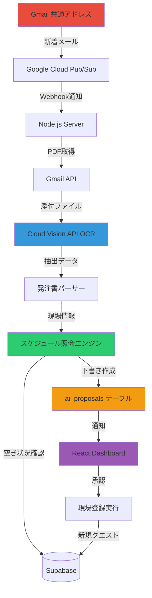

# 自動クエスト生成システム設計書

## 概要

Gmail監視 → OCR解析 → スケジュール照会 → 新規現場下書き作成という一連の自動化フローを実装し、注文書受信から現場登録までの事務作業を完全自動化します。

**半DAOの理想形**: AI/自動化が全て処理し、人間は最終承認のみを行う

---

## 1. システムアーキテクチャ



---

## 2. フェーズ別実装計画

### Phase 1: Gmail監視とOCR解析（2週間）

**目標**: 注文書PDF自動読み取り

#### 2.1 Gmail API設定

```typescript
// server/src/services/GmailWatcher.ts
import { google } from 'googleapis';

interface GmailConfig {
  clientId: string;
  clientSecret: string;
  refreshToken: string;
  topicName: string; // projects/PROJECT_ID/topics/gmail-notifications
}

export class GmailWatcher {
  private gmail: any;

  async setupWatch(userEmail: string): Promise<void> {
    // 7日間有効なwatch設定
    const res = await this.gmail.users.watch({
      userId: 'me',
      requestBody: {
        topicName: this.config.topicName,
        labelIds: ['INBOX'],
        labelFilterAction: 'include'
      }
    });

    console.log('[GMAIL_WATCH] 監視開始:', res.data);
    // historyId を保存（次回の差分取得用）
  }

  async renewWatch(): Promise<void> {
    // Cron job: 毎週金曜日に更新
  }
}
```

#### 2.2 Pub/Sub Webhook受信

```typescript
// server/src/routes/webhooks.ts
import express from 'express';

const router = express.Router();

router.post('/gmail-notification', async (req, res) => {
  try {
    // Pub/Subからのメッセージ
    const message = req.body.message;
    const data = Buffer.from(message.data, 'base64').toString('utf-8');
    const notification = JSON.parse(data);

    console.log('[GMAIL_WEBHOOK] 新着通知:', notification);

    // historyIdを使って新しいメールを取得
    const historyId = notification.historyId;
    await processNewMessages(historyId);

    // 即座にACK返却（5秒以内）
    res.status(200).send('OK');
  } catch (error) {
    console.error('[GMAIL_WEBHOOK] エラー:', error);
    res.status(500).json({ error: error.message });
  }
});

export default router;
```

#### 2.3 OCR実装

```typescript
// server/src/services/OcrService.ts
import vision from '@google-cloud/vision';
import { Storage } from '@google-cloud/storage';

export class OcrService {
  private client = new vision.ImageAnnotatorClient();

  async extractFromPdf(
    gcsUri: string // gs://bucket-name/file.pdf
  ): Promise<string> {
    const [result] = await this.client.documentTextDetection({
      image: { source: { imageUri: gcsUri } }
    });

    const fullText = result.fullTextAnnotation?.text || '';
    console.log('[OCR] テキスト抽出成功:', fullText.length, '文字');

    return fullText;
  }
}
```

#### 2.4 発注書パーサー

```typescript
// server/src/services/OrderParser.ts

interface ParsedOrder {
  siteName: string;
  address: string;
  clientName: string;
  contactPerson?: string;
  startDate: Date;
  endDate: Date;
  revenue: number;
  workTypes: string[];
  estimatedHours?: number;
}

export class OrderParser {
  /**
   * OCRテキストから発注書情報を抽出
   */
  parseOcrText(text: string): ParsedOrder | null {
    // 正規表現 + AI補助でパース
    const lines = text.split('\n');

    const siteName = this.extractSiteName(lines);
    const address = this.extractAddress(lines);
    const dates = this.extractDates(lines);
    const revenue = this.extractRevenue(lines);

    if (!siteName || !dates) {
      console.warn('[PARSER] 必須項目が見つかりません');
      return null;
    }

    return {
      siteName,
      address: address || '',
      clientName: this.extractClientName(lines) || '不明',
      startDate: dates.start,
      endDate: dates.end,
      revenue: revenue || 0,
      workTypes: this.extractWorkTypes(lines),
      estimatedHours: this.calculateEstimatedHours(dates.start, dates.end)
    };
  }

  private extractSiteName(lines: string[]): string | null {
    // 「工事名」「現場名」「件名」などのキーワード検索
    const keywords = ['工事名', '現場名', '件名', '物件名'];
    for (const line of lines) {
      for (const kw of keywords) {
        if (line.includes(kw)) {
          // 例: "工事名：〇〇ビル改修工事"
          return line.split(/[:：]/)[1]?.trim();
        }
      }
    }
    return null;
  }

  private extractDates(lines: string[]): { start: Date; end: Date } | null {
    // 「工期」「期間」などから日付抽出
    const datePattern = /(\d{4})[年\/\-](\d{1,2})[月\/\-](\d{1,2})/g;
    const matches = [...lines.join('\n').matchAll(datePattern)];

    if (matches.length >= 2) {
      const [y1, m1, d1] = matches[0].slice(1, 4).map(Number);
      const [y2, m2, d2] = matches[1].slice(1, 4).map(Number);
      return {
        start: new Date(y1, m1 - 1, d1),
        end: new Date(y2, m2 - 1, d2)
      };
    }
    return null;
  }

  private extractRevenue(lines: string[]): number | null {
    // 「請負金額」「合計金額」などから数値抽出
    const amountPattern = /[¥￥]?\s*([\d,]+)\s*円/;
    for (const line of lines) {
      if (line.includes('請負金額') || line.includes('合計金額')) {
        const match = line.match(amountPattern);
        if (match) {
          return parseInt(match[1].replace(/,/g, ''), 10);
        }
      }
    }
    return null;
  }
}
```

---

### Phase 2: スケジュール照会エンジン（2週間）

**目標**: パーティメンバーの空き状況自動判定

#### 2.1 DBスキーマ拡張

```sql
-- server/sql/010_schedule_system.sql

-- sitesテーブルに工期を追加
ALTER TABLE sites
ADD COLUMN start_date date,
ADD COLUMN end_date date,
ADD COLUMN estimated_man_hours numeric DEFAULT 0; -- 延べ人工数

-- スケジュールインデックス（期間検索の高速化）
CREATE INDEX IF NOT EXISTS sites_date_range_idx
ON sites (start_date, end_date)
WHERE status IN ('active', 'planned');

-- 個人スケジュール（休暇・出張など）
CREATE TABLE IF NOT EXISTS personal_schedules (
  id uuid PRIMARY KEY DEFAULT gen_random_uuid(),
  user_id uuid REFERENCES auth.users(id) ON DELETE CASCADE,
  start_date date NOT NULL,
  end_date date NOT NULL,
  type text NOT NULL CHECK (type IN ('vacation', 'sick_leave', 'business_trip', 'training')),
  reason text,
  approved boolean DEFAULT false,
  created_at timestamptz DEFAULT now()
);

CREATE INDEX personal_schedules_user_date_idx
ON personal_schedules (user_id, start_date, end_date);

-- RLS設定
ALTER TABLE personal_schedules ENABLE ROW LEVEL SECURITY;

CREATE POLICY "Read Own Schedules"
ON personal_schedules FOR SELECT
TO authenticated
USING (auth.uid() = user_id);

CREATE POLICY "Insert Own Schedules"
ON personal_schedules FOR INSERT
TO authenticated
WITH CHECK (auth.uid() = user_id);
```

#### 2.2 スケジュール照会API

```typescript
// server/src/services/ScheduleChecker.ts

interface Availability {
  userId: string;
  userName: string;
  available: boolean;
  conflicts: ConflictInfo[];
  utilizationRate: number; // 稼働率 (0-100%)
}

interface ConflictInfo {
  siteId?: string;
  siteName?: string;
  type: 'site_assignment' | 'personal_schedule';
  startDate: Date;
  endDate: Date;
  reason?: string;
}

export class ScheduleChecker {
  /**
   * 指定期間のメンバー空き状況を確認
   */
  async checkAvailability(
    startDate: Date,
    endDate: Date,
    requiredSkills?: string[]
  ): Promise<Availability[]> {
    const { data: members, error } = await supabase
      .from('profiles')
      .select('id, username, full_name')
      .eq('role', 'member'); // または skillsフィルター

    if (error) throw error;

    const results: Availability[] = [];

    for (const member of members) {
      const conflicts = await this.findConflicts(member.id, startDate, endDate);
      const utilization = await this.calculateUtilization(member.id, startDate, endDate);

      results.push({
        userId: member.id,
        userName: member.full_name || member.username,
        available: conflicts.length === 0,
        conflicts,
        utilizationRate: utilization
      });
    }

    // 稼働率の低い順にソート（空いている人を優先）
    return results.sort((a, b) => a.utilizationRate - b.utilizationRate);
  }

  private async findConflicts(
    userId: string,
    startDate: Date,
    endDate: Date
  ): Promise<ConflictInfo[]> {
    const conflicts: ConflictInfo[] = [];

    // 1. 既存現場のアサインチェック
    const { data: sites } = await supabase
      .from('sites')
      .select('id, name, start_date, end_date')
      .contains('assigned_users', [userId])
      .in('status', ['active', 'planned'])
      .or(`start_date.lte.${endDate.toISOString()},end_date.gte.${startDate.toISOString()}`);

    if (sites) {
      conflicts.push(...sites.map(s => ({
        siteId: s.id,
        siteName: s.name,
        type: 'site_assignment' as const,
        startDate: new Date(s.start_date),
        endDate: new Date(s.end_date)
      })));
    }

    // 2. 個人スケジュール（休暇など）チェック
    const { data: schedules } = await supabase
      .from('personal_schedules')
      .select('*')
      .eq('user_id', userId)
      .eq('approved', true)
      .or(`start_date.lte.${endDate.toISOString()},end_date.gte.${startDate.toISOString()}`);

    if (schedules) {
      conflicts.push(...schedules.map(s => ({
        type: 'personal_schedule' as const,
        startDate: new Date(s.start_date),
        endDate: new Date(s.end_date),
        reason: s.reason
      })));
    }

    return conflicts;
  }
}
```

---

### Phase 3: AI自動提案とダッシュボード統合（2週間）

**目標**: 「新しいクエストが発生しました！」通知と下書き画面

#### 3.1 ai_proposalsテーブル拡張

```sql
-- server/sql/011_auto_quest_proposals.sql

-- proposal_type に 'auto_quest' を追加
ALTER TABLE ai_proposals
DROP CONSTRAINT IF EXISTS ai_proposals_proposal_type_check;

ALTER TABLE ai_proposals
ADD CONSTRAINT ai_proposals_proposal_type_check
CHECK (proposal_type IN (
  'site_invoice',
  'holiday_adjustment',
  'risk_alert',
  'auto_quest' -- 新規追加
));

-- auto_questの場合のデータ構造
-- proposal_data JSONB example:
-- {
--   "siteName": "〇〇ビル改修工事",
--   "address": "東京都...",
--   "clientName": "株式会社〇〇",
--   "contactPerson": "田中太郎",
--   "startDate": "2026-03-01",
--   "endDate": "2026-03-31",
--   "revenue": 5000000,
--   "workTypes": ["塗装", "防水"],
--   "estimatedHours": 240,
--   "gmailMessageId": "abc123...",
--   "pdfUrl": "gs://bucket/orders/2026-02-02_abc123.pdf",
--   "ocrText": "...",
--   "availability": [
--     { "userId": "...", "userName": "佐藤", "available": true, "utilizationRate": 20 },
--     { "userId": "...", "userName": "鈴木", "available": false, "conflicts": [...] }
--   ]
-- }
```

#### 3.2 自動提案生成

```typescript
// server/src/services/AutoQuestProposer.ts
import { GmailWatcher } from './GmailWatcher';
import { OcrService } from './OcrService';
import { OrderParser } from './OrderParser';
import { ScheduleChecker } from './ScheduleChecker';

export class AutoQuestProposer {
  async processNewOrder(gmailMessageId: string): Promise<void> {
    console.log('[AUTO_QUEST] 注文書処理開始:', gmailMessageId);

    // 1. Gmail添付ファイル取得 → GCS保存
    const pdfUrl = await this.uploadToGcs(gmailMessageId);

    // 2. OCR実行
    const ocrText = await this.ocrService.extractFromPdf(pdfUrl);

    // 3. パース
    const parsed = this.orderParser.parseOcrText(ocrText);
    if (!parsed) {
      console.warn('[AUTO_QUEST] パース失敗 - 手動確認が必要');
      // Slackやメールで通知
      return;
    }

    // 4. スケジュール照会
    const availability = await this.scheduleChecker.checkAvailability(
      parsed.startDate,
      parsed.endDate
    );

    // 5. ai_proposalsに登録
    const { data, error } = await supabase
      .from('ai_proposals')
      .insert({
        proposal_type: 'auto_quest',
        title: `新規クエスト：${parsed.siteName}`,
        description: this.generateQuestDescription(parsed, availability),
        proposal_data: {
          ...parsed,
          gmailMessageId,
          pdfUrl,
          ocrText,
          availability
        },
        confidence_score: this.calculateConfidence(parsed),
        created_by: null, // システム生成
        status: 'pending'
      })
      .select()
      .single();

    if (error) throw error;

    console.log('[AUTO_QUEST] 提案作成完了:', data.id);

    // 6. Webプッシュ通知 or WebSocket通知
    await this.notifyDashboard(data.id);
  }

  private generateQuestDescription(
    parsed: ParsedOrder,
    availability: Availability[]
  ): string {
    const availableMembers = availability.filter(a => a.available);
    const busyMembers = availability.filter(a => !a.available);

    return `
🏗️ **新しい討伐依頼が届きました！**

**現場**: ${parsed.siteName}
**場所**: ${parsed.address}
**報酬**: ¥${parsed.revenue.toLocaleString()}
**期間**: ${parsed.startDate.toLocaleDateString('ja-JP')} 〜 ${parsed.endDate.toLocaleDateString('ja-JP')}

**パーティー編成可能メンバー (${availableMembers.length}人)**:
${availableMembers.slice(0, 5).map(m => `- ${m.userName} (稼働率: ${m.utilizationRate}%)`).join('\n')}

${busyMembers.length > 0 ? `**出撃中 (${busyMembers.length}人)**:\n${busyMembers.slice(0, 3).map(m => `- ${m.userName} (${m.conflicts[0]?.siteName || '予定あり'})`).join('\n')}` : ''}
    `.trim();
  }

  private calculateConfidence(parsed: ParsedOrder): number {
    // パース成功率を0-100で返す
    let score = 0;
    if (parsed.siteName) score += 30;
    if (parsed.address) score += 20;
    if (parsed.startDate && parsed.endDate) score += 30;
    if (parsed.revenue > 0) score += 20;
    return score;
  }
}
```

#### 3.3 ダッシュボードUI拡張

```typescript
// frontend/src/components/AutoQuestCard.tsx
import { motion, AnimatePresence } from 'framer-motion';
import { Sparkles, MapPin, Calendar, DollarSign, Users, CheckCircle, XCircle } from 'lucide-react';
import type { AiProposal } from '../lib/api';
import styles from './AutoQuestCard.module.css';

interface AutoQuestCardProps {
  proposal: AiProposal;
  onApprove: () => void;
  onReject: () => void;
}

export function AutoQuestCard({ proposal, onApprove, onReject }: AutoQuestCardProps) {
  const data = proposal.proposal_data as any;
  const availableCount = data.availability?.filter((a: any) => a.available).length || 0;

  return (
    <motion.div
      className={styles.card}
      initial={{ scale: 0.8, opacity: 0, y: 50 }}
      animate={{ scale: 1, opacity: 1, y: 0 }}
      exit={{ scale: 0.8, opacity: 0, y: -50 }}
      transition={{ type: 'spring', damping: 15 }}
    >
      {/* 新規バッジ */}
      <div className={styles.newBadge}>
        <Sparkles size={16} />
        NEW QUEST
      </div>

      {/* 信頼度スコア */}
      <div className={styles.confidence}>
        <span>AI信頼度</span>
        <div className={styles.confidenceBar}>
          <motion.div
            className={styles.confidenceFill}
            initial={{ width: 0 }}
            animate={{ width: `${proposal.confidence_score}%` }}
            transition={{ duration: 0.8, delay: 0.2 }}
          />
        </div>
        <span>{proposal.confidence_score}%</span>
      </div>

      {/* クエスト情報 */}
      <h3 className={styles.questName}>{data.siteName}</h3>

      <div className={styles.details}>
        <div className={styles.detailRow}>
          <MapPin size={16} />
          <span>{data.address}</span>
        </div>
        <div className={styles.detailRow}>
          <Calendar size={16} />
          <span>
            {new Date(data.startDate).toLocaleDateString('ja-JP')} 〜
            {new Date(data.endDate).toLocaleDateString('ja-JP')}
          </span>
        </div>
        <div className={styles.detailRow}>
          <DollarSign size={16} />
          <span className={styles.revenue}>¥{data.revenue?.toLocaleString()}</span>
        </div>
        <div className={styles.detailRow}>
          <Users size={16} />
          <span>{availableCount}人 編成可能</span>
        </div>
      </div>

      {/* 空きメンバー表示 */}
      {data.availability && data.availability.length > 0 && (
        <div className={styles.availability}>
          <h4>パーティー候補</h4>
          <div className={styles.memberList}>
            {data.availability.slice(0, 4).map((member: any, i: number) => (
              <motion.div
                key={member.userId}
                className={`${styles.member} ${!member.available ? styles.busy : ''}`}
                initial={{ opacity: 0, x: -20 }}
                animate={{ opacity: 1, x: 0 }}
                transition={{ delay: 0.3 + i * 0.1 }}
              >
                <span className={styles.memberName}>{member.userName}</span>
                <span className={styles.utilization}>
                  {member.available ? `${member.utilizationRate}%` : '出撃中'}
                </span>
              </motion.div>
            ))}
          </div>
        </div>
      )}

      {/* アクションボタン */}
      <div className={styles.actions}>
        <button className={styles.rejectButton} onClick={onReject}>
          <XCircle size={18} />
          却下
        </button>
        <button className={styles.approveButton} onClick={onApprove}>
          <CheckCircle size={18} />
          クエスト受注
        </button>
      </div>
    </motion.div>
  );
}
```

---

### Phase 4: インフォグラフィック生成（1週間）

**目標**: 現場ごとの業務フローを自動図解

#### 4.1 Mermaid図生成サービス

```typescript
// server/src/services/InfographicGenerator.ts

interface SiteFlowData {
  siteId: string;
  siteName: string;
  phases: {
    name: string;
    startDate: Date;
    endDate: Date;
    assignedUsers: string[];
    tasks: string[];
  }[];
}

export class InfographicGenerator {
  /**
   * 現場の業務フローをMermaid形式で生成
   */
  generateSiteFlow(data: SiteFlowData): string {
    const phases = data.phases;

    let mermaid = `
gantt
    title ${data.siteName} 業務フロー
    dateFormat YYYY-MM-DD

`;

    phases.forEach((phase, i) => {
      mermaid += `    section ${phase.name}\n`;
      phase.tasks.forEach(task => {
        const start = phase.startDate.toISOString().split('T')[0];
        const end = phase.endDate.toISOString().split('T')[0];
        mermaid += `    ${task} :${start}, ${end}\n`;
      });
    });

    return mermaid;
  }

  /**
   * パーティメンバーのタイムライン図生成
   */
  generateMemberTimeline(userId: string, startDate: Date, endDate: Date): string {
    // ユーザーの全現場アサインを取得してタイムライン化
    return `
gantt
    title メンバー稼働状況
    dateFormat YYYY-MM-DD

    section 現場A
    作業 :2026-02-01, 2026-02-15

    section 現場B
    作業 :2026-02-16, 2026-02-28
    `;
  }

  /**
   * プロジェクト全体の進捗フローチャート
   */
  generateProgressFlow(siteId: string): string {
    return `
flowchart TB
    Start[クエスト受注] --> Planning[計画立案]
    Planning --> Approval{承認}
    Approval -->|承認| Exec[現場開始]
    Approval -->|却下| Planning
    Exec --> Daily[日報記録]
    Daily --> Check{進捗確認}
    Check -->|順調| Daily
    Check -->|遅延| Alert[アラート]
    Alert --> Meeting[対策会議]
    Meeting --> Daily
    Exec --> Complete[現場完了]
    Complete --> Invoice[請求書発行]
    Invoice --> Payment[入金確認]
    Payment --> End[クエストクリア]

    style Start fill:#2ecc71
    style End fill:#3498db
    style Alert fill:#e74c3c
    `;
  }
}
```

#### 4.2 フロントエンド表示

```typescript
// frontend/src/components/SiteFlowVisualization.tsx
import { useEffect, useRef } from 'react';
import mermaid from 'mermaid';
import styles from './SiteFlowVisualization.module.css';

interface SiteFlowVisualizationProps {
  mermaidCode: string;
}

export function SiteFlowVisualization({ mermaidCode }: SiteFlowVisualizationProps) {
  const containerRef = useRef<HTMLDivElement>(null);

  useEffect(() => {
    if (containerRef.current) {
      mermaid.initialize({
        startOnLoad: true,
        theme: 'dark', // レトロゲーム風のダークテーマ
        themeVariables: {
          primaryColor: '#00ff41', // ターミナル風グリーン
          primaryTextColor: '#fff',
          primaryBorderColor: '#00ff41',
          lineColor: '#f39c12',
          secondaryColor: '#3498db',
          tertiaryColor: '#e74c3c'
        }
      });

      mermaid.render('mermaid-diagram', mermaidCode).then(({ svg }) => {
        if (containerRef.current) {
          containerRef.current.innerHTML = svg;
        }
      });
    }
  }, [mermaidCode]);

  return (
    <div className={styles.container}>
      <h3 className={styles.title}>
        📊 業務フロー可視化
      </h3>
      <div ref={containerRef} className={styles.diagram} />
    </div>
  );
}
```

---

## 3. 技術調査結果

### 3.1 Gmail API + Pub/Sub

**実現可能性**: ✅ 完全に可能

- [Gmail API Push Notifications](https://developers.google.com/workspace/gmail/api/guides/push): 公式サポート、2026年現在も利用可能
- [Cloud Pub/Sub Integration](https://kb.torq.io/en/articles/9138324-receive-gmail-push-notifications-using-google-cloud-pub-sub): Webhook配信対応
- **制約**: watch()は7日間で期限切れ → Cron jobで毎週更新が必要

**コスト**:
- Gmail API: 無料（quota制限あり）
- Cloud Pub/Sub: 最初の10GBまで無料

### 3.2 Cloud Vision API OCR

**実現可能性**: ✅ 日本語PDF完全対応

- [PDF/TIFF OCR](https://docs.cloud.google.com/vision/docs/pdf): 公式機能
- [日本語サポート](https://docs.cloud.google.com/vision/docs/languages): ほぼ完璧な精度
- **特徴**: 表組み、手書き風文字も認識可能

**コスト**:
- 月1,000ページまで無料
- それ以降: $1.50/1,000ページ

### 3.3 Mermaid.js

**実現可能性**: ✅ React統合簡単

- [Mermaid.js](https://mermaid.js.org/): 2026年も活発に開発中
- [30種類の新シェイプ](https://github.com/mermaid-js/mermaid/releases): フローチャート強化
- **特徴**: Ganttチャート、フローチャート、タイムライン対応

**統合方法**:
```bash
npm install mermaid
```

---

## 4. データフロー詳細

### 4.1 注文書受信からクエスト生成まで

```
1. Gmail受信 (0秒)
   ↓
2. Pub/Sub通知 (1-5秒)
   ↓
3. Webhook受信 (即時)
   ↓
4. PDF取得 + GCSアップロード (3-10秒)
   ↓
5. OCR実行 (10-30秒) ← ここが一番遅い
   ↓
6. パース処理 (1-2秒)
   ↓
7. スケジュール照会 (2-5秒)
   ↓
8. ai_proposals登録 (1秒)
   ↓
9. ダッシュボード通知 (即時)

合計: 約30-60秒
```

### 4.2 承認フロー

```
1. ユーザーが「クエスト受注」ボタンクリック
   ↓
2. ai_proposals.status = 'approved'
   ↓
3. sites テーブルに新規レコード作成
   ↓
4. monsters テーブルにモンスター生成
   ↓
5. Gemini APIでモンスター画像生成 (オプション)
   ↓
6. ダッシュボードに新クエスト表示
```

---

## 5. UI/UX設計

### 5.1 新規クエスト通知演出

```css
/* frontend/src/components/AutoQuestCard.module.css */
.card {
  background: linear-gradient(135deg, #667eea 0%, #764ba2 100%);
  border: 2px solid #00ff41;
  box-shadow: 0 0 30px rgba(0, 255, 65, 0.5);
  animation: pulse 2s infinite;
}

@keyframes pulse {
  0%, 100% {
    box-shadow: 0 0 30px rgba(0, 255, 65, 0.5);
  }
  50% {
    box-shadow: 0 0 50px rgba(0, 255, 65, 0.8);
  }
}

.newBadge {
  position: absolute;
  top: -10px;
  right: -10px;
  background: #e74c3c;
  color: white;
  padding: 8px 16px;
  border-radius: 20px;
  font-weight: bold;
  animation: bounce 1s infinite;
}

@keyframes bounce {
  0%, 100% { transform: translateY(0); }
  50% { transform: translateY(-10px); }
}
```

### 5.2 承認後のアニメーション

```typescript
// モンスターカード生成アニメーション
<motion.div
  initial={{ scale: 0, rotate: -180 }}
  animate={{ scale: 1, rotate: 0 }}
  transition={{ type: 'spring', damping: 10 }}
>
  <MonsterBattleCard data={newQuest} />
</motion.div>
```

---

## 6. セキュリティ考慮事項

### 6.1 Gmail OAuth認証

```typescript
// .env.example
GOOGLE_CLIENT_ID=xxx
GOOGLE_CLIENT_SECRET=xxx
GOOGLE_REFRESH_TOKEN=xxx
GOOGLE_PUBSUB_TOPIC=projects/PROJECT_ID/topics/gmail-notifications
```

**RLS設定**:
- ai_proposals: 全員読み取り可、承認権限者のみ更新可
- personal_schedules: 本人のみ読み書き可

### 6.2 OCRデータの取り扱い

- PDFファイルはGCS (Google Cloud Storage) に暗号化保存
- OCRテキストはai_proposals.proposal_data内にJSONBで保存
- 個人情報（連絡先など）はマスキングオプション提供

---

## 7. エラーハンドリング

### 7.1 OCR失敗時

```typescript
if (!parsed || parsed.confidence < 70) {
  // 手動確認が必要な旨を通知
  await supabase.from('ai_proposals').insert({
    proposal_type: 'auto_quest',
    title: '注文書の手動確認が必要',
    description: `OCR精度が低いため、手動で確認してください。\n\nGmail: ${gmailMessageId}`,
    proposal_data: { gmailMessageId, ocrText, pdfUrl },
    confidence_score: parsed?.confidence || 0,
    status: 'pending'
  });
}
```

### 7.2 スケジュール競合時

```typescript
const availableMembers = availability.filter(a => a.available);

if (availableMembers.length === 0) {
  // 警告付きで提案
  description += '\n\n⚠️ **警告**: 全員が他のクエストに出撃中です。要調整。';
}
```

---

## 8. 実装順序（推奨）

### Week 1-2: Gmail監視 + OCR
1. Google Cloud Projectセットアップ
2. Pub/Sub Topic作成
3. Gmail API認証フロー実装
4. Webhook受信エンドポイント作成
5. OCRサービス実装
6. 発注書パーサー実装

### Week 3-4: スケジュール照会
1. DBマイグレーション（start_date/end_date追加）
2. personal_schedulesテーブル作成
3. ScheduleCheckerサービス実装
4. 稼働率計算ロジック実装

### Week 5-6: UI統合
1. AutoQuestCardコンポーネント作成
2. ai_proposals拡張
3. 承認フロー実装
4. 通知システム実装

### Week 7: インフォグラフィック
1. InfographicGeneratorサービス実装
2. Mermaid.js統合
3. SiteFlowVisualizationコンポーネント作成

---

## 9. 成功指標 (KPI)

### 9.1 自動化率
- **目標**: 注文書受信 → 現場登録の90%以上を自動化
- **測定**: `auto_quest`提案の承認率

### 9.2 処理速度
- **目標**: 受信から提案表示まで60秒以内
- **測定**: Webhook受信 → ai_proposals作成までの時間

### 9.3 OCR精度
- **目標**: 信頼度スコア80%以上
- **測定**: confidence_scoreの平均値

### 9.4 スケジュール精度
- **目標**: 競合検出率100%
- **測定**: 後日発覚した競合の件数（ゼロが理想）

---

## 10. 今後の拡張案

### 10.1 AIアシスタント強化

```typescript
// Gemini APIで不明点を補完
const enhanced = await gemini.generateContent(`
以下のOCRテキストから、不足している情報を推測してください：

${ocrText}

特に以下を推測：
- 工事種別
- 必要人工数
- クライアント連絡先
`);
```

### 10.2 地図統合

```typescript
// Google Maps APIで距離計算
const distance = await calculateDistance(
  '本部住所',
  parsed.address
);

if (distance > 50) {
  description += '\n⚠️ 遠方現場です（${distance}km）';
}
```

### 10.3 自動見積もり

```typescript
// 過去データから自動見積もり
const estimatedCost = await predictCost({
  workTypes: parsed.workTypes,
  area: parsed.areaSqm,
  duration: daysBetween(parsed.startDate, parsed.endDate)
});

proposal_data.estimatedProfit = parsed.revenue - estimatedCost;
```

---

## Sources

- [Gmail API Push Notifications](https://developers.google.com/workspace/gmail/api/guides/push)
- [Cloud Pub/Sub Integration](https://kb.torq.io/en/articles/9138324-receive-gmail-push-notifications-using-google-cloud-pub-sub)
- [Gmail API Webhook Tutorial](https://livefiredev.com/step-by-step-gmail-api-webhook-to-monitor-emails-node-js/)
- [Cloud Vision API PDF OCR](https://docs.cloud.google.com/vision/docs/pdf)
- [OCR Language Support](https://docs.cloud.google.com/vision/docs/languages)
- [Mermaid.js Documentation](https://mermaid.js.org/)
- [Mermaid Flowchart Syntax](https://mermaid.js.org/syntax/flowchart.html)
