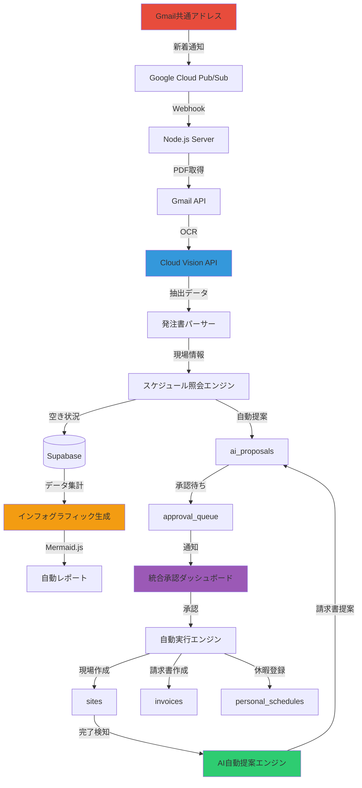
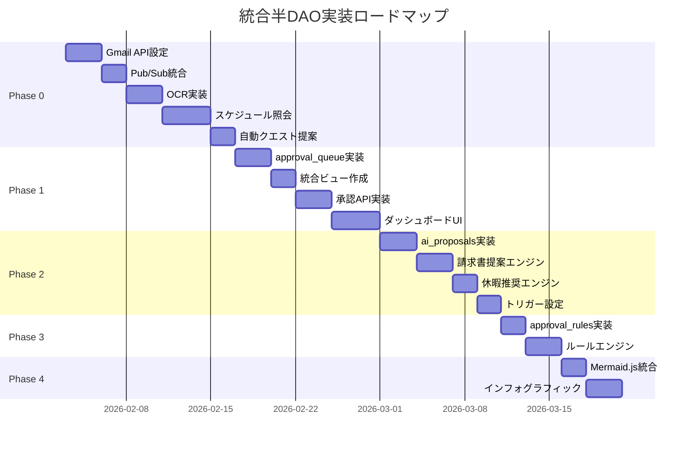
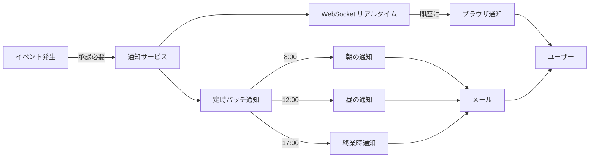

# GENBA QUEST - 統合半DAO実装設計書

**Version**: 2.0 (統合版)
**Date**: 2026-02-02
**Status**: Final Draft

---

## エグゼクティブサマリー

本設計書は、SEMI_DAO_DESIGN.md（承認ワークフロー）とAUTO_QUEST_GENERATION.md（Gmail自動クエスト生成）を統合し、GENBA QUESTを**完全な半DAOシステム**へと進化させる統合マスタープランです。

### ビジョン

```
従来: 人間が全てを手作業で処理
    └─ 注文書受信 → 手動入力 → 手動スケジュール調整 → 手動承認 → 手動請求

半DAO: AIが自動処理し、人間は承認のみ
    └─ Gmail監視 → AI自動入力 → AIスケジュール提案 → 人間承認 → AI自動実行
```

### 統合により実現する機能

| フェーズ | 機能 | 自動化レベル | 工数削減 |
|---------|-----|------------|---------|
| **Phase 0** | Gmail監視とOCR注文書読み取り | 95% | 30分→30秒 |
| **Phase 1** | 統合承認ダッシュボード | 80% | 分散→一元化 |
| **Phase 2** | AI自動提案エンジン | 90% | 手動→自動提案 |
| **Phase 3** | スマートルール自動承認 | 95% | 承認作業70%削減 |
| **Phase 4** | インフォグラフィック自動生成 | 100% | レポート作成不要 |

**合計効果**: 事務作業時間を**80%削減**、人間は戦略的判断に集中

---

## 目次

1. [統合アーキテクチャ](#1-統合アーキテクチャ)
2. [Phase 0: Gmail自動クエスト生成](#2-phase-0-gmail自動クエスト生成)
3. [Phase 1: 統合承認ダッシュボード](#3-phase-1-統合承認ダッシュボード)
4. [Phase 2: AI自動提案エンジン](#4-phase-2-ai自動提案エンジン)
5. [Phase 3: スマートルール自動承認](#5-phase-3-スマートルール自動承認)
6. [Phase 4: インフォグラフィック自動生成](#6-phase-4-インフォグラフィック自動生成)
7. [統合データベース設計](#7-統合データベース設計)
8. [統合API設計](#8-統合api設計)
9. [UI/UX統合設計](#9-uiux統合設計)
10. [実装ロードマップ](#10-実装ロードマップ)
11. [リスク管理と成功指標](#11-リスク管理と成功指標)
12. [ユーザーペルソナ設計](#12-ユーザーペルソナ設計)
13. [モバイル対応戦略](#13-モバイル対応戦略)
14. [通知システム設計](#14-通知システム設計)
15. [セキュリティ強化計画](#15-セキュリティ強化計画)
16. [Feature Flag & ロールバック計画](#16-feature-flag--ロールバック計画)

---

## 1. 統合アーキテクチャ

### 1.1 システム全体像



### 1.2 データフロー統合

```
┌─ 入力自動化 ──────────────────────────────────────┐
│ Gmail → OCR → パース → スケジュール照会            │
│ 【Phase 0】                                       │
└──────────────┬────────────────────────────────────┘
               │
               ▼
┌─ AI判断層 ────────────────────────────────────────┐
│ Gemini/Claude が状況分析 → 提案生成               │
│ 【Phase 2】                                       │
└──────────────┬────────────────────────────────────┘
               │
               ▼
┌─ 承認層 ──────────────────────────────────────────┐
│ 統合ダッシュボードで一元承認                       │
│ 【Phase 1】                                       │
│                                                   │
│ スマートルールで自動承認（条件付き）               │
│ 【Phase 3】                                       │
└──────────────┬────────────────────────────────────┘
               │
               ▼
┌─ 自動実行層 ──────────────────────────────────────┐
│ 承認後の処理を完全自動化                           │
│ - 現場登録                                        │
│ - 請求書発行                                      │
│ - 仕訳計上                                        │
│ 【Phase 2】                                       │
└──────────────┬────────────────────────────────────┘
               │
               ▼
┌─ 可視化層 ────────────────────────────────────────┐
│ 業務フロー・進捗を自動図解                         │
│ 【Phase 4】                                       │
└───────────────────────────────────────────────────┘
```

---

## 2. Phase 0: Gmail自動クエスト生成

**優先度**: 🔴 最高
**期間**: 2週間
**担当**: バックエンド + インフラ
**目標**: 注文書受信から30秒でクエスト提案

### 2.1 Gmail API + Pub/Sub設定

#### Google Cloud Project設定

```bash
# 1. GCPプロジェクト作成
gcloud projects create genba-quest-production

# 2. API有効化
gcloud services enable gmail.googleapis.com
gcloud services enable pubsub.googleapis.com
gcloud services enable vision.googleapis.com

# 3. Pub/Sub Topic作成
gcloud pubsub topics create gmail-notifications

# 4. Service Account作成
gcloud iam service-accounts create gmail-watcher \
  --display-name="Gmail Watcher Service Account"

# 5. 権限付与
gcloud pubsub topics add-iam-policy-binding gmail-notifications \
  --member=serviceAccount:gmail-api-push@system.gserviceaccount.com \
  --role=roles/pubsub.publisher
```

#### Gmail Watch設定

```typescript
// server/src/services/GmailWatcher.ts
import { google } from 'googleapis';
import { supabase } from '../lib/supabase';

interface GmailConfig {
  clientId: string;
  clientSecret: string;
  refreshToken: string;
  topicName: string;
}

export class GmailWatcher {
  private gmail: any;
  private config: GmailConfig;

  constructor(config: GmailConfig) {
    this.config = config;
    const oauth2Client = new google.auth.OAuth2(
      config.clientId,
      config.clientSecret
    );
    oauth2Client.setCredentials({ refresh_token: config.refreshToken });
    this.gmail = google.gmail({ version: 'v1', auth: oauth2Client });
  }

  /**
   * Gmail監視を開始（7日間有効）
   */
  async setupWatch(userEmail: string): Promise<void> {
    try {
      const res = await this.gmail.users.watch({
        userId: 'me',
        requestBody: {
          topicName: this.config.topicName,
          labelIds: ['INBOX'],
          labelFilterAction: 'include'
        }
      });

      console.log('[GMAIL_WATCH] 監視開始:', {
        email: userEmail,
        historyId: res.data.historyId,
        expiration: new Date(parseInt(res.data.expiration))
      });

      // SupabaseにhistoryId保存（次回の差分取得用）
      await supabase.from('system_config').upsert({
        key: 'gmail_history_id',
        value: res.data.historyId,
        updated_at: new Date().toISOString()
      });
    } catch (error: any) {
      console.error('[GMAIL_WATCH] エラー:', error.message);
      throw error;
    }
  }

  /**
   * Watch更新（Cron jobで毎週実行）
   */
  async renewWatch(): Promise<void> {
    console.log('[GMAIL_WATCH] 更新中...');
    await this.setupWatch('orders@genba-quest.jp');
  }

  /**
   * 新着メッセージ取得
   */
  async getNewMessages(historyId: string): Promise<any[]> {
    const res = await this.gmail.users.history.list({
      userId: 'me',
      startHistoryId: historyId,
      historyTypes: ['messageAdded']
    });

    if (!res.data.history) return [];

    const messages: any[] = [];
    for (const record of res.data.history) {
      if (record.messagesAdded) {
        messages.push(...record.messagesAdded.map((m: any) => m.message));
      }
    }

    return messages;
  }
}
```

### 2.2 Pub/Sub Webhook受信

```typescript
// server/src/routes/webhooks.ts
import express from 'express';
import { GmailWatcher } from '../services/GmailWatcher';
import { AutoQuestProposer } from '../services/AutoQuestProposer';

const router = express.Router();

/**
 * Gmail Pub/Sub通知エンドポイント
 */
router.post('/gmail-notification', async (req, res) => {
  try {
    // 1. Pub/Subメッセージをデコード
    const message = req.body.message;
    if (!message || !message.data) {
      return res.status(400).send('Invalid message format');
    }

    const data = Buffer.from(message.data, 'base64').toString('utf-8');
    const notification = JSON.parse(data);

    console.log('[WEBHOOK] Gmail通知受信:', {
      emailAddress: notification.emailAddress,
      historyId: notification.historyId
    });

    // 2. ACKを即座に返す（5秒以内必須）
    res.status(200).send('OK');

    // 3. 非同期で処理（レスポンス後）
    processNotification(notification).catch(err => {
      console.error('[WEBHOOK] 処理エラー:', err);
    });

  } catch (error: any) {
    console.error('[WEBHOOK] パースエラー:', error.message);
    res.status(500).json({ error: error.message });
  }
});

async function processNotification(notification: any) {
  const { historyId } = notification;

  // 前回のhistoryIdを取得
  const { data: config } = await supabase
    .from('system_config')
    .select('value')
    .eq('key', 'gmail_history_id')
    .single();

  if (!config) {
    console.warn('[WEBHOOK] 初回実行 - historyId未保存');
    return;
  }

  // 新着メッセージ取得
  const watcher = new GmailWatcher({
    clientId: process.env.GOOGLE_CLIENT_ID!,
    clientSecret: process.env.GOOGLE_CLIENT_SECRET!,
    refreshToken: process.env.GOOGLE_REFRESH_TOKEN!,
    topicName: process.env.GOOGLE_PUBSUB_TOPIC!
  });

  const messages = await watcher.getNewMessages(config.value);

  console.log(`[WEBHOOK] 新着メッセージ: ${messages.length}件`);

  // 注文書のみフィルタリング
  for (const msg of messages) {
    const shouldProcess = await isOrderEmail(msg);
    if (shouldProcess) {
      console.log('[WEBHOOK] 注文書検知:', msg.id);
      await AutoQuestProposer.processNewOrder(msg.id);
    }
  }

  // historyId更新
  await supabase.from('system_config').upsert({
    key: 'gmail_history_id',
    value: historyId,
    updated_at: new Date().toISOString()
  });
}

async function isOrderEmail(message: any): Promise<boolean> {
  // 件名に「注文書」「発注書」が含まれるか
  // または PDF添付ファイルがあるか
  return true; // 簡易実装
}

export default router;
```

### 2.3 OCR + パーサー統合

```typescript
// server/src/services/AutoQuestProposer.ts
import { OcrService } from './OcrService';
import { OrderParser } from './OrderParser';
import { ScheduleChecker } from './ScheduleChecker';
import { supabase } from '../lib/supabase';

export class AutoQuestProposer {
  private static ocrService = new OcrService();
  private static orderParser = new OrderParser();
  private static scheduleChecker = new ScheduleChecker();

  /**
   * 注文書から自動クエスト提案を生成
   */
  static async processNewOrder(gmailMessageId: string): Promise<void> {
    console.log('[AUTO_QUEST] 処理開始:', gmailMessageId);

    try {
      // 1. Gmail添付ファイル取得 → GCS保存
      const pdfUrl = await this.uploadPdfToGcs(gmailMessageId);
      console.log('[AUTO_QUEST] PDF保存:', pdfUrl);

      // 2. OCR実行
      const ocrText = await this.ocrService.extractFromPdf(pdfUrl);
      console.log('[AUTO_QUEST] OCR完了:', ocrText.length, '文字');

      // 3. パース
      const parsed = this.orderParser.parseOcrText(ocrText);
      if (!parsed) {
        console.warn('[AUTO_QUEST] パース失敗 - 手動確認が必要');
        await this.createManualReviewProposal(gmailMessageId, ocrText, pdfUrl);
        return;
      }

      console.log('[AUTO_QUEST] パース成功:', parsed.siteName);

      // 4. スケジュール照会
      const availability = await this.scheduleChecker.checkAvailability(
        parsed.startDate,
        parsed.endDate
      );

      console.log('[AUTO_QUEST] 空きメンバー:', availability.filter(a => a.available).length, '人');

      // 5. ai_proposalsに登録
      const { data: proposal, error } = await supabase
        .from('ai_proposals')
        .insert({
          proposal_type: 'auto_quest',
          title: `新規クエスト：${parsed.siteName}`,
          description: this.generateQuestDescription(parsed, availability),
          proposal_data: {
            ...parsed,
            gmailMessageId,
            pdfUrl,
            ocrText,
            availability
          },
          ai_provider: 'cloud_vision',
          ai_model: 'ocr',
          ai_confidence: this.calculateConfidence(parsed),
          status: 'pending',
          expires_at: new Date(Date.now() + 7 * 24 * 60 * 60 * 1000) // 7日後
        })
        .select()
        .single();

      if (error) throw error;

      console.log('[AUTO_QUEST] 提案作成完了:', proposal.id);

      // 6. approval_queueに追加
      await supabase.from('approval_queue').insert({
        item_type: 'auto_quest',
        item_id: proposal.id,
        assigned_to: await this.getOrderApprover(),
        priority: 'high',
        ai_recommendation: availability.filter(a => a.available).length > 0 ? 'approve' : 'review_required',
        ai_confidence: proposal.ai_confidence,
        ai_reason: `OCR解析成功、空きメンバー${availability.filter(a => a.available).length}人`
      });

      // 7. WebSocket通知（リアルタイム）
      await this.notifyDashboard(proposal.id);

      console.log('[AUTO_QUEST] 完了');

    } catch (error: any) {
      console.error('[AUTO_QUEST] エラー:', error.message);
      throw error;
    }
  }

  private static generateQuestDescription(
    parsed: any,
    availability: any[]
  ): string {
    const availableMembers = availability.filter(a => a.available);
    const busyMembers = availability.filter(a => !a.available);

    return `
🏗️ **新しい討伐依頼が届きました！**

**現場**: ${parsed.siteName}
**場所**: ${parsed.address}
**クライアント**: ${parsed.clientName}
**報酬**: ¥${parsed.revenue.toLocaleString()}
**期間**: ${parsed.startDate.toLocaleDateString('ja-JP')} 〜 ${parsed.endDate.toLocaleDateString('ja-JP')}
**予想工数**: ${parsed.estimatedHours}時間

**パーティー編成可能メンバー (${availableMembers.length}人)**:
${availableMembers.slice(0, 5).map(m => `- ${m.userName} (稼働率: ${m.utilizationRate}%)`).join('\n')}

${busyMembers.length > 0 ? `\n**現在出撃中 (${busyMembers.length}人)**:\n${busyMembers.slice(0, 3).map(m => `- ${m.userName} (${m.conflicts[0]?.siteName || '予定あり'})`).join('\n')}` : ''}
    `.trim();
  }

  private static calculateConfidence(parsed: any): number {
    let score = 0;
    if (parsed.siteName) score += 30;
    if (parsed.address) score += 20;
    if (parsed.startDate && parsed.endDate) score += 30;
    if (parsed.revenue > 0) score += 20;
    return score / 100;
  }

  private static async getOrderApprover(): Promise<string> {
    // 権限が最も高いユーザーを取得
    const { data } = await supabase
      .from('profiles')
      .select('id')
      .in('role', ['admin', 'manager'])
      .order('approval_limit', { ascending: false })
      .limit(1)
      .single();

    return data?.id || '';
  }
}
```

### 2.4 DBスキーマ拡張

```sql
-- server/sql/010_auto_quest_system.sql

-- sitesテーブルに工期を追加
ALTER TABLE sites
ADD COLUMN IF NOT EXISTS start_date date,
ADD COLUMN IF NOT EXISTS end_date date,
ADD COLUMN IF NOT EXISTS estimated_man_hours numeric DEFAULT 0;

-- 個人スケジュールテーブル
CREATE TABLE IF NOT EXISTS personal_schedules (
  id uuid PRIMARY KEY DEFAULT gen_random_uuid(),
  user_id uuid REFERENCES auth.users(id) ON DELETE CASCADE,
  start_date date NOT NULL,
  end_date date NOT NULL,
  type text NOT NULL CHECK (type IN ('vacation', 'sick_leave', 'business_trip', 'training')),
  reason text,
  approved boolean DEFAULT false,
  created_at timestamptz DEFAULT now()
);

CREATE INDEX personal_schedules_user_date_idx
ON personal_schedules (user_id, start_date, end_date);

-- RLS設定
ALTER TABLE personal_schedules ENABLE ROW LEVEL SECURITY;

CREATE POLICY "Read Own Schedules"
ON personal_schedules FOR SELECT
TO authenticated
USING (auth.uid() = user_id);

CREATE POLICY "Insert Own Schedules"
ON personal_schedules FOR INSERT
TO authenticated
WITH CHECK (auth.uid() = user_id);

-- システム設定テーブル
CREATE TABLE IF NOT EXISTS system_config (
  key text PRIMARY KEY,
  value text NOT NULL,
  updated_at timestamptz DEFAULT now()
);

-- Gmail historyId保存
INSERT INTO system_config (key, value)
VALUES ('gmail_history_id', '0')
ON CONFLICT (key) DO NOTHING;
```

---

## 3. Phase 1: 統合承認ダッシュボード

**優先度**: 🔴 最高
**期間**: 2週間
**担当**: フルスタック
**目標**: 全承認を1画面で完結

### 3.1 approval_queueテーブル拡張

```sql
-- server/sql/011_approval_queue.sql

CREATE TABLE IF NOT EXISTS approval_queue (
  id uuid PRIMARY KEY DEFAULT gen_random_uuid(),

  -- 承認対象の識別
  item_type text NOT NULL
    CHECK (item_type IN (
      'expense',        -- 経費承認
      'invoice',        -- 請求書承認
      'perk',           -- パーク承認
      'holiday',        -- 休暇承認
      'auto_quest',     -- 自動クエスト承認 ← NEW
      'site_order',     -- 受注承認
      'investment'      -- 大型投資承認
    )),
  item_id uuid NOT NULL,

  -- 承認者情報
  assigned_to uuid REFERENCES auth.users(id),
  assigned_at timestamptz DEFAULT now(),

  -- 優先度・期限
  priority text DEFAULT 'normal'
    CHECK (priority IN ('low', 'normal', 'high', 'urgent')),
  due_date timestamptz,

  -- AI推奨
  ai_recommendation text CHECK (ai_recommendation IN ('approve', 'reject', 'review_required')),
  ai_confidence numeric CHECK (ai_confidence >= 0 AND ai_confidence <= 1),
  ai_reason text,

  -- ステータス
  status text DEFAULT 'pending'
    CHECK (status IN ('pending', 'approved', 'rejected', 'escalated', 'auto_approved')),

  -- 処理結果
  reviewed_by uuid REFERENCES auth.users(id),
  reviewed_at timestamptz,
  review_comment text,

  -- メタ
  created_at timestamptz DEFAULT now(),

  UNIQUE(item_type, item_id)
);

CREATE INDEX approval_queue_assigned_idx ON approval_queue(assigned_to, status);
CREATE INDEX approval_queue_priority_idx ON approval_queue(priority, due_date);

-- RLS設定
ALTER TABLE approval_queue ENABLE ROW LEVEL SECURITY;

CREATE POLICY "Read Assigned Approvals"
ON approval_queue FOR SELECT
TO authenticated
USING (assigned_to = auth.uid() OR auth.uid() IN (
  SELECT id FROM profiles WHERE role IN ('admin', 'manager')
));

CREATE POLICY "Update Assigned Approvals"
ON approval_queue FOR UPDATE
TO authenticated
USING (assigned_to = auth.uid());
```

### 3.2 統合ビュー

```sql
-- server/sql/012_unified_approval_view.sql

CREATE OR REPLACE VIEW unified_approval_view AS
SELECT
  q.id as approval_id,
  q.item_type,
  q.item_id,
  q.assigned_to,
  q.priority,
  q.due_date,
  q.ai_recommendation,
  q.ai_confidence,
  q.ai_reason,
  q.status,

  -- 経費の場合
  CASE WHEN q.item_type = 'expense' THEN
    jsonb_build_object(
      'vendor_name', t.vendor_name,
      'amount', t.amount_total,
      'description', t.description,
      'category', t.category,
      'risk_level', t.risk_level,
      'receipt_url', t.receipt_url
    )
  END as expense_data,

  -- 請求書の場合
  CASE WHEN q.item_type = 'invoice' THEN
    jsonb_build_object(
      'invoice_number', inv.invoice_number,
      'client_name', c.name,
      'amount', inv.amount_total,
      'due_date', inv.due_date,
      'status', inv.status
    )
  END as invoice_data,

  -- パークの場合
  CASE WHEN q.item_type = 'perk' THEN
    jsonb_build_object(
      'applicant', p.username,
      'badge_id', ba.badge_id,
      'level', ba.level,
      'reason', ba.reason,
      'vote_count', (SELECT COUNT(*) FROM badge_votes WHERE application_id = ba.id AND vote = 'approve')
    )
  END as perk_data,

  -- 自動クエストの場合 ← NEW
  CASE WHEN q.item_type = 'auto_quest' THEN
    ap.proposal_data
  END as auto_quest_data,

  q.created_at

FROM approval_queue q
LEFT JOIN accounting_transactions t ON (q.item_type = 'expense' AND q.item_id = t.id)
LEFT JOIN invoices inv ON (q.item_type = 'invoice' AND q.item_id = inv.id)
LEFT JOIN clients c ON (inv.client_id = c.id)
LEFT JOIN badge_applications ba ON (q.item_type = 'perk' AND q.item_id = ba.id)
LEFT JOIN profiles p ON (ba.applicant_id = p.id)
LEFT JOIN ai_proposals ap ON (q.item_type = 'auto_quest' AND q.item_id = ap.id);
```

### 3.3 統合承認API

```typescript
// server/src/routes/approvals.ts
import express from 'express';
import { requireAuth } from '../middleware/authMiddleware';
import { supabase } from '../lib/supabase';

const router = express.Router();

/**
 * GET /api/v1/approvals/queue
 * すべての承認待ちを取得
 */
router.get('/queue', requireAuth, async (req, res) => {
  try {
    const userId = req.user!.id;
    const { status = 'pending', priority, item_type } = req.query;

    let query = supabase
      .from('unified_approval_view')
      .select('*')
      .eq('assigned_to', userId)
      .eq('status', status)
      .order('priority', { ascending: false })
      .order('created_at', { ascending: true });

    if (priority) query = query.eq('priority', priority);
    if (item_type) query = query.eq('item_type', item_type);

    const { data: items, error } = await query;
    if (error) throw error;

    // サマリー集計
    const summary = {
      total: items.length,
      by_type: items.reduce((acc: any, item) => {
        acc[item.item_type] = (acc[item.item_type] || 0) + 1;
        return acc;
      }, {}),
      by_priority: items.reduce((acc: any, item) => {
        acc[item.priority] = (acc[item.priority] || 0) + 1;
        return acc;
      }, {})
    };

    res.json({ items, summary });
  } catch (error: any) {
    console.error('[APPROVALS] エラー:', error);
    res.status(500).json({ error: error.message });
  }
});

/**
 * POST /api/v1/approvals/:id/approve
 * 承認実行
 */
router.post('/:id/approve', requireAuth, async (req, res) => {
  try {
    const { id } = req.params;
    const { comment } = req.body;
    const userId = req.user!.id;

    // 1. approval_queue更新
    const { data: approval, error: updateError } = await supabase
      .from('approval_queue')
      .update({
        status: 'approved',
        reviewed_by: userId,
        reviewed_at: new Date().toISOString(),
        review_comment: comment
      })
      .eq('id', id)
      .eq('assigned_to', userId)
      .select()
      .single();

    if (updateError) throw updateError;

    // 2. 元データの処理実行
    await executeApproval(approval);

    console.log('[APPROVAL] 承認完了:', id);
    res.json({ success: true, approval });

  } catch (error: any) {
    console.error('[APPROVAL] エラー:', error);
    res.status(500).json({ error: error.message });
  }
});

/**
 * POST /api/v1/approvals/batch-review
 * 一括承認
 */
router.post('/batch-review', requireAuth, async (req, res) => {
  try {
    const { approval_ids, action, comment } = req.body;
    const userId = req.user!.id;

    const results = {
      success: [] as string[],
      failed: [] as any[]
    };

    for (const approvalId of approval_ids) {
      try {
        const { data: approval } = await supabase
          .from('approval_queue')
          .update({
            status: action === 'approve' ? 'approved' : 'rejected',
            reviewed_by: userId,
            reviewed_at: new Date().toISOString(),
            review_comment: comment
          })
          .eq('id', approvalId)
          .eq('assigned_to', userId)
          .select()
          .single();

        if (approval && action === 'approve') {
          await executeApproval(approval);
        }

        results.success.push(approvalId);
      } catch (error: any) {
        results.failed.push({
          approval_id: approvalId,
          error: error.message
        });
      }
    }

    res.json(results);
  } catch (error: any) {
    res.status(500).json({ error: error.message });
  }
});

/**
 * 承認後の自動実行
 */
async function executeApproval(approval: any) {
  const { item_type, item_id } = approval;

  switch (item_type) {
    case 'expense':
      // 経費を承認済みに変更 + 仕訳計上
      await supabase
        .from('accounting_transactions')
        .update({ status: 'posted' })
        .eq('id', item_id);
      break;

    case 'auto_quest':
      // 自動クエスト → 現場作成
      await createSiteFromProposal(item_id);
      break;

    case 'invoice':
      // 請求書承認 → ステータス更新
      await supabase
        .from('invoices')
        .update({ status: 'sent' })
        .eq('id', item_id);
      break;

    case 'perk':
      // パーク承認 → バッジ付与
      await supabase
        .from('badge_applications')
        .update({ status: 'approved' })
        .eq('id', item_id);
      break;

    default:
      console.warn('[EXECUTE] 未実装の承認タイプ:', item_type);
  }
}

/**
 * ai_proposalsから現場を作成
 */
async function createSiteFromProposal(proposalId: string) {
  const { data: proposal } = await supabase
    .from('ai_proposals')
    .select('*')
    .eq('id', proposalId)
    .single();

  if (!proposal) throw new Error('提案が見つかりません');

  const data = proposal.proposal_data as any;

  // 現場作成
  const { data: site, error } = await supabase
    .from('sites')
    .insert({
      name: data.siteName,
      address: data.address,
      start_date: data.startDate,
      end_date: data.endDate,
      revenue: data.revenue,
      work_types: data.workTypes,
      estimated_man_hours: data.estimatedHours,
      status: 'planned',
      assigned_users: data.availability
        ?.filter((a: any) => a.available)
        .slice(0, 3)
        .map((a: any) => a.userId) || []
    })
    .select()
    .single();

  if (error) throw error;

  console.log('[EXECUTE] 現場作成完了:', site.id);

  // ai_proposals更新
  await supabase
    .from('ai_proposals')
    .update({
      status: 'executed',
      executed_at: new Date().toISOString(),
      execution_result: { site_id: site.id }
    })
    .eq('id', proposalId);
}

export default router;
```

---

## 4. Phase 2: AI自動提案エンジン

**優先度**: 🟡 高
**期間**: 2週間
**担当**: AIエンジニア + バックエンド
**目標**: 現場完了→請求書、スタミナ低下→休暇など自動提案

### 4.1 ai_proposalsテーブル拡張

```sql
-- server/sql/013_ai_proposals.sql

CREATE TABLE IF NOT EXISTS ai_proposals (
  id uuid PRIMARY KEY DEFAULT gen_random_uuid(),

  -- 提案タイプ
  proposal_type text NOT NULL
    CHECK (proposal_type IN (
      'auto_quest',            -- 自動クエスト生成 ← Phase 0
      'site_invoice',          -- 請求書作成
      'holiday_adjustment',    -- 休暇推奨
      'budget_alert',          -- 予算アラート
      'deadline_alert',        -- 納期アラート
      'schedule_optimization', -- スケジュール最適化
      'risk_detection'         -- リスク検知
    )),

  -- タイトル・説明
  title text NOT NULL,
  description text,

  -- 対象リソース
  target_type text,
  target_id uuid,

  -- AI判定
  ai_provider text DEFAULT 'gemini',
  ai_model text,
  ai_confidence numeric CHECK (ai_confidence >= 0 AND ai_confidence <= 1),
  ai_reasoning text,

  -- 提案内容（JSONB）
  proposal_data jsonb NOT NULL,

  -- ステータス
  status text DEFAULT 'pending'
    CHECK (status IN ('pending', 'approved', 'rejected', 'executed', 'failed')),

  -- 処理情報
  created_by uuid REFERENCES auth.users(id),
  reviewed_by uuid REFERENCES auth.users(id),
  reviewed_at timestamptz,
  executed_at timestamptz,
  execution_result jsonb,

  -- メタ
  created_at timestamptz DEFAULT now(),
  expires_at timestamptz,

  -- 監査用
  audit_log jsonb DEFAULT '[]'::jsonb
);

CREATE INDEX ai_proposals_status_idx ON ai_proposals(status, created_at);
CREATE INDEX ai_proposals_target_idx ON ai_proposals(target_type, target_id);
CREATE INDEX ai_proposals_type_idx ON ai_proposals(proposal_type);

-- RLS設定
ALTER TABLE ai_proposals ENABLE ROW LEVEL SECURITY;

CREATE POLICY "Read All Proposals"
ON ai_proposals FOR SELECT
TO authenticated
USING (true);

CREATE POLICY "System Insert Proposals"
ON ai_proposals FOR INSERT
TO authenticated
WITH CHECK (created_by IS NULL OR created_by = auth.uid());
```

### 4.2 提案エンジン実装

```typescript
// server/src/services/ProposalEngine.ts
import { supabase } from '../lib/supabase';
import { callGemini } from '../lib/gemini';

export class ProposalEngine {
  /**
   * 現場完了→請求書自動生成提案
   */
  static async proposeSiteInvoice(siteId: string): Promise<void> {
    console.log('[PROPOSAL] 請求書提案生成:', siteId);

    // 1. 現場データ取得
    const { data: site } = await supabase
      .from('sites')
      .select('*, client:clients(*)')
      .eq('id', siteId)
      .single();

    if (!site) throw new Error('現場が見つかりません');

    // 2. 経費集計
    const { data: expenses } = await supabase
      .from('accounting_transactions')
      .select('amount_total')
      .eq('site_id', siteId)
      .eq('kind', 'expense')
      .eq('status', 'posted');

    const totalExpenses = expenses?.reduce((sum, e) => sum + e.amount_total, 0) || 0;

    // 3. AIに提案を依頼
    const prompt = `
あなたは経理AIアシスタントです。以下の現場が完了しました。請求書を作成すべきか判断してください。

現場情報:
- 名称: ${site.name}
- クライアント: ${site.client.name}
- 売上予定: ¥${site.revenue.toLocaleString()}
- 実績工数: ${site.actual_hours}h
- 経費合計: ¥${totalExpenses.toLocaleString()}
- 完了日: ${site.completed_at}

判断基準:
1. 現場完了から3日以内に請求書を作成すべき
2. 売上予定額をベースに請求金額を提案
3. 経費が予算を大幅に超えている場合は警告

以下のJSON形式で回答してください:
{
  "should_create": true/false,
  "confidence": 0.0-1.0,
  "reasoning": "理由",
  "proposed_amount": 金額,
  "proposed_due_date": "YYYY-MM-DD",
  "warnings": ["警告があれば"]
}
`;

    const aiResponse = await callGemini(prompt);
    const proposal = JSON.parse(aiResponse);

    if (proposal.should_create && proposal.confidence > 0.7) {
      // 4. ai_proposals作成
      const { data, error } = await supabase.from('ai_proposals').insert({
        proposal_type: 'site_invoice',
        title: `請求書作成：${site.name}`,
        description: proposal.reasoning,
        target_type: 'site',
        target_id: siteId,
        ai_provider: 'gemini',
        ai_model: 'gemini-2.0-flash-exp',
        ai_confidence: proposal.confidence,
        ai_reasoning: proposal.reasoning,
        proposal_data: {
          site_id: siteId,
          client_id: site.client_id,
          amount_subtotal: Math.round(proposal.proposed_amount / 1.1),
          tax_amount: Math.round(proposal.proposed_amount * 0.1),
          amount_total: proposal.proposed_amount,
          due_date: proposal.proposed_due_date,
          warnings: proposal.warnings
        },
        expires_at: new Date(Date.now() + 7 * 24 * 60 * 60 * 1000)
      }).select().single();

      if (error) throw error;

      // 5. approval_queueに追加
      await supabase.from('approval_queue').insert({
        item_type: 'invoice_proposal',
        item_id: data.id,
        assigned_to: await this.getFinanceApprover(),
        priority: 'high',
        ai_recommendation: 'approve',
        ai_confidence: proposal.confidence,
        ai_reason: proposal.reasoning
      });

      console.log('[PROPOSAL] 請求書提案作成完了:', data.id);
    }
  }

  /**
   * スタミナ低下→休暇推奨
   */
  static async proposeHoliday(userId: string): Promise<void> {
    const { data: profile } = await supabase
      .from('profiles')
      .select('*')
      .eq('id', userId)
      .single();

    if (!profile || profile.stamina >= 30) return;

    const prompt = `
ユーザー ${profile.full_name} のスタミナが ${profile.stamina}% に低下しています。
休暇日数残高: ${profile.holiday_days} 日

推奨アクション:
1. 休暇を取得すべきか判断
2. 推奨日数を提案
3. タイミング（即座 or 週末待ち）

JSON形式で回答:
{
  "should_take_holiday": true/false,
  "confidence": 0.0-1.0,
  "recommended_days": 日数,
  "start_date": "YYYY-MM-DD",
  "reasoning": "理由"
}
`;

    const aiResponse = await callGemini(prompt);
    const proposal = JSON.parse(aiResponse);

    if (proposal.should_take_holiday && proposal.confidence > 0.8) {
      await supabase.from('ai_proposals').insert({
        proposal_type: 'holiday_adjustment',
        title: `休暇推奨：${profile.full_name}`,
        description: proposal.reasoning,
        target_type: 'user',
        target_id: userId,
        ai_provider: 'gemini',
        ai_confidence: proposal.confidence,
        ai_reasoning: proposal.reasoning,
        proposal_data: {
          user_id: userId,
          recommended_days: proposal.recommended_days,
          start_date: proposal.start_date
        }
      });
    }
  }

  private static async getFinanceApprover(): Promise<string> {
    const { data } = await supabase
      .from('profiles')
      .select('id')
      .in('role', ['admin', 'manager'])
      .order('approval_limit', { ascending: false })
      .limit(1)
      .single();

    return data?.id || '';
  }
}
```

### 4.3 トリガー設定

```sql
-- server/sql/014_proposal_triggers.sql

-- 現場完了時に請求書提案をトリガー
CREATE OR REPLACE FUNCTION trigger_invoice_proposal()
RETURNS TRIGGER AS $$
BEGIN
  IF NEW.status = 'completed' AND OLD.status != 'completed' THEN
    -- Node.jsサービスにWebhook送信（または直接関数呼び出し）
    PERFORM net.http_post(
      url := 'http://localhost:3000/api/internal/trigger-invoice-proposal',
      headers := '{"Content-Type": "application/json"}'::jsonb,
      body := json_build_object('site_id', NEW.id)::text
    );
  END IF;
  RETURN NEW;
END;
$$ LANGUAGE plpgsql;

CREATE TRIGGER on_site_completed
AFTER UPDATE ON sites
FOR EACH ROW
EXECUTE FUNCTION trigger_invoice_proposal();

-- スタミナ低下時に休暇提案をトリガー
CREATE OR REPLACE FUNCTION trigger_holiday_proposal()
RETURNS TRIGGER AS $$
BEGIN
  IF NEW.stamina < 30 AND (OLD.stamina IS NULL OR OLD.stamina >= 30) THEN
    PERFORM net.http_post(
      url := 'http://localhost:3000/api/internal/trigger-holiday-proposal',
      headers := '{"Content-Type": "application/json"}'::jsonb,
      body := json_build_object('user_id', NEW.id)::text
    );
  END IF;
  RETURN NEW;
END;
$$ LANGUAGE plpgsql;

CREATE TRIGGER on_stamina_low
AFTER UPDATE ON profiles
FOR EACH ROW
EXECUTE FUNCTION trigger_holiday_proposal();
```

---

## 5. Phase 3: スマートルール自動承認

**優先度**: 🟢 中
**期間**: 1週間
**担当**: バックエンド
**目標**: 条件付き自動承認で70%削減

### 5.1 approval_rulesテーブル

```sql
-- server/sql/015_approval_rules.sql

CREATE TABLE IF NOT EXISTS approval_rules (
  id uuid PRIMARY KEY DEFAULT gen_random_uuid(),

  -- ルール名
  name text NOT NULL,
  description text,

  -- 適用対象
  item_type text NOT NULL,

  -- 条件（JSONB）
  conditions jsonb NOT NULL,
  -- 例: {"amount_lt": 50000, "risk_level": "LOW"}

  -- アクション
  auto_action text NOT NULL
    CHECK (auto_action IN ('auto_approve', 'auto_reject', 'escalate', 'require_review')),

  -- 有効化
  enabled boolean DEFAULT true,

  -- 優先度（高い方が先に評価）
  priority integer DEFAULT 0,

  -- 作成者
  created_by uuid REFERENCES auth.users(id),
  created_at timestamptz DEFAULT now(),
  updated_at timestamptz DEFAULT now()
);

CREATE INDEX approval_rules_type_idx ON approval_rules(item_type, enabled);

-- サンプルルール挿入
INSERT INTO approval_rules (name, description, item_type, conditions, auto_action, priority)
VALUES
  ('少額経費自動承認', '5万円以下かつリスクLOWなら自動承認', 'expense',
   '{"amount_total_lte": 50000, "risk_level": "LOW"}'::jsonb,
   'auto_approve', 10),

  ('高額経費要確認', '10万円以上は必ず人間確認', 'expense',
   '{"amount_total_gte": 100000}'::jsonb,
   'require_review', 20),

  ('OCR高精度自動クエスト', '信頼度90%以上なら自動承認', 'auto_quest',
   '{"ai_confidence_gte": 0.9, "available_members_gte": 2}'::jsonb,
   'auto_approve', 15);
```

### 5.2 ルールエンジン実装

```typescript
// server/src/services/RuleEngine.ts
import { supabase } from '../lib/supabase';

export class RuleEngine {
  /**
   * approval_queueに追加時にルール評価
   */
  static async evaluateRules(approvalId: string): Promise<void> {
    const { data: approval } = await supabase
      .from('approval_queue')
      .select('*')
      .eq('id', approvalId)
      .single();

    if (!approval) return;

    // ルール取得
    const { data: rules } = await supabase
      .from('approval_rules')
      .select('*')
      .eq('item_type', approval.item_type)
      .eq('enabled', true)
      .order('priority', { ascending: false });

    if (!rules || rules.length === 0) return;

    // アイテムデータ取得
    const itemData = await this.getItemData(approval.item_type, approval.item_id);

    // ルール評価
    for (const rule of rules) {
      if (this.matchesConditions(itemData, rule.conditions)) {
        console.log('[RULE_ENGINE] マッチ:', rule.name);
        await this.applyRule(approvalId, rule);
        return; // 最初にマッチしたルールで終了
      }
    }
  }

  private static matchesConditions(data: any, conditions: any): boolean {
    for (const [key, value] of Object.entries(conditions)) {
      // 演算子サポート: _gte, _lte, _eq, _in
      if (key.endsWith('_gte')) {
        const field = key.replace('_gte', '');
        if (!(data[field] >= value)) return false;
      } else if (key.endsWith('_lte')) {
        const field = key.replace('_lte', '');
        if (!(data[field] <= value)) return false;
      } else if (key.endsWith('_eq')) {
        const field = key.replace('_eq', '');
        if (data[field] !== value) return false;
      } else {
        // 単純な等価比較
        if (data[key] !== value) return false;
      }
    }
    return true;
  }

  private static async applyRule(approvalId: string, rule: any): Promise<void> {
    const { auto_action } = rule;

    if (auto_action === 'auto_approve') {
      // 自動承認実行
      await supabase
        .from('approval_queue')
        .update({
          status: 'auto_approved',
          reviewed_by: null, // システム承認
          reviewed_at: new Date().toISOString(),
          review_comment: `自動承認ルール適用: ${rule.name}`
        })
        .eq('id', approvalId);

      // 実行処理
      const { data: approval } = await supabase
        .from('approval_queue')
        .select('*')
        .eq('id', approvalId)
        .single();

      if (approval) {
        // TODO: executeApproval(approval);
      }

      console.log('[RULE_ENGINE] 自動承認完了:', approvalId);
    }
  }

  private static async getItemData(itemType: string, itemId: string): Promise<any> {
    // item_typeに応じてデータ取得
    switch (itemType) {
      case 'expense':
        const { data } = await supabase
          .from('accounting_transactions')
          .select('*')
          .eq('id', itemId)
          .single();
        return data;

      case 'auto_quest':
        const { data: proposal } = await supabase
          .from('ai_proposals')
          .select('*')
          .eq('id', itemId)
          .single();
        return {
          ...proposal?.proposal_data,
          ai_confidence: proposal?.ai_confidence
        };

      default:
        return {};
    }
  }
}
```

---

## 6. Phase 4: インフォグラフィック自動生成

**優先度**: 🔵 低
**期間**: 1週間
**担当**: フロントエンド
**目標**: 業務フロー・進捗を自動図解

### 6.1 Mermaid.js統合

```typescript
// server/src/services/InfographicGenerator.ts

export class InfographicGenerator {
  /**
   * 現場の業務フローをGanttチャートで生成
   */
  static generateSiteGantt(siteId: string, phases: any[]): string {
    let mermaid = `
gantt
    title 現場業務フロー
    dateFormat YYYY-MM-DD
    axisFormat %m/%d

`;

    phases.forEach(phase => {
      mermaid += `    section ${phase.name}\n`;
      phase.tasks.forEach((task: any) => {
        mermaid += `    ${task.name} :${task.start}, ${task.end}\n`;
      });
    });

    return mermaid;
  }

  /**
   * メンバー稼働タイムライン
   */
  static generateMemberTimeline(userId: string, sites: any[]): string {
    let mermaid = `
gantt
    title メンバー稼働状況
    dateFormat YYYY-MM-DD

`;

    sites.forEach(site => {
      mermaid += `    section ${site.name}\n`;
      mermaid += `    作業 :${site.start_date}, ${site.end_date}\n`;
    });

    return mermaid;
  }

  /**
   * プロジェクト進捗フローチャート
   */
  static generateProgressFlow(): string {
    return `
flowchart TB
    Start[クエスト受注] --> Planning[計画立案]
    Planning --> Approval{承認}
    Approval -->|承認| Exec[現場開始]
    Approval -->|却下| Planning
    Exec --> Daily[日報記録]
    Daily --> Check{進捗確認}
    Check -->|順調| Daily
    Check -->|遅延| Alert[アラート]
    Alert --> Meeting[対策会議]
    Meeting --> Daily
    Exec --> Complete[現場完了]
    Complete --> Invoice[請求書発行]
    Invoice --> Payment[入金確認]
    Payment --> End[クエストクリア]

    style Start fill:#2ecc71
    style End fill:#3498db
    style Alert fill:#e74c3c
`;
  }
}
```

### 6.2 フロントエンド表示

```typescript
// frontend/src/components/SiteFlowVisualization.tsx
import { useEffect, useRef } from 'react';
import mermaid from 'mermaid';
import styles from './SiteFlowVisualization.module.css';

interface Props {
  mermaidCode: string;
}

export function SiteFlowVisualization({ mermaidCode }: Props) {
  const containerRef = useRef<HTMLDivElement>(null);

  useEffect(() => {
    mermaid.initialize({
      startOnLoad: true,
      theme: 'dark',
      themeVariables: {
        primaryColor: '#00ff41',
        primaryTextColor: '#fff',
        primaryBorderColor: '#00ff41',
        lineColor: '#f39c12',
        secondaryColor: '#3498db',
        tertiaryColor: '#e74c3c'
      }
    });

    if (containerRef.current) {
      mermaid.render('mermaid-diagram', mermaidCode).then(({ svg }) => {
        if (containerRef.current) {
          containerRef.current.innerHTML = svg;
        }
      });
    }
  }, [mermaidCode]);

  return (
    <div className={styles.container}>
      <h3 className={styles.title}>📊 業務フロー可視化</h3>
      <div ref={containerRef} className={styles.diagram} />
    </div>
  );
}
```

---

## 7. 統合データベース設計

### 7.1 新規テーブル一覧

| テーブル名 | 目的 | Phase |
|-----------|-----|-------|
| `system_config` | システム設定（Gmail historyIdなど） | 0 |
| `personal_schedules` | 個人スケジュール（休暇・出張） | 0 |
| `approval_queue` | 統合承認キュー | 1 |
| `ai_proposals` | AI自動提案 | 2 |
| `approval_rules` | 自動承認ルール | 3 |

### 7.2 既存テーブル拡張

```sql
-- sites拡張
ALTER TABLE sites
ADD COLUMN start_date date,
ADD COLUMN end_date date,
ADD COLUMN estimated_man_hours numeric DEFAULT 0;

CREATE INDEX sites_date_range_idx ON sites (start_date, end_date)
WHERE status IN ('active', 'planned');
```

---

## 8. 統合API設計

### 8.1 新規エンドポイント

| エンドポイント | メソッド | 目的 |
|--------------|---------|-----|
| `/api/webhooks/gmail-notification` | POST | Pub/Sub通知受信 |
| `/api/v1/approvals/queue` | GET | 承認待ち一覧 |
| `/api/v1/approvals/:id/approve` | POST | 承認実行 |
| `/api/v1/approvals/batch-review` | POST | 一括承認 |
| `/api/v1/proposals/site-invoice` | POST | 請求書提案生成 |
| `/api/v1/proposals/holiday` | POST | 休暇推奨 |
| `/api/v1/rules` | GET/POST | ルール管理 |
| `/api/v1/infographics/site/:id` | GET | 現場フロー図 |
| `/api/internal/trigger-invoice-proposal` | POST | 内部トリガー |

---

## 9. UI/UX統合設計

### 9.1 ダッシュボード統合

```
┌─ GENBA QUEST ダッシュボード ─────────────────────────┐
│                                                      │
│  🎮 QUEST STATUS                                     │
│  ┌─────────────────────────────────────────────┐   │
│  │ 📬 新着クエスト (2件)          [すべて見る]  │   │
│  │ ┌────────────────────────────────┐          │   │
│  │ │ 🆕 〇〇ビル改修工事             │          │   │
│  │ │ 報酬: ¥5,000,000 | 期間: 3/1-3/31 │       │   │
│  │ │ AI推奨: 承認 ✅ (92%)          │          │   │
│  │ │ [クエスト受注] [詳細]          │          │   │
│  │ └────────────────────────────────┘          │   │
│  └─────────────────────────────────────────────┘   │
│                                                      │
│  ⚡ 承認待ち (15件)                                  │
│  ┌─────────────────────────────────────────────┐   │
│  │ 🔴 緊急 (2) | 🟡 高 (5) | 🟢 通常 (8)        │   │
│  │                                             │   │
│  │ [経費] ¥45,000 - 材料費                     │   │
│  │ AI推奨: 承認 ✅ (信頼度: 92%)               │   │
│  │ [ワンクリック承認]                          │   │
│  │                                             │   │
│  │ [請求書] 株式会社ABC - ¥550,000            │   │
│  │ AI生成 | 期限: 2/15                         │   │
│  │ [承認] [編集] [却下]                        │   │
│  └─────────────────────────────────────────────┘   │
│                                                      │
│  🏗️ 進行中の現場 (5件)                              │
│  [MonsterBattleCard × 5]                            │
│                                                      │
│  📊 業務フロー可視化                                 │
│  [Mermaid Gantt Chart]                              │
│                                                      │
└──────────────────────────────────────────────────────┘
```

---

## 10. 実装ロードマップ

### 全体スケジュール: 8週間



### 週次目標

| 週 | フェーズ | 成果物 | 検証項目 |
|----|---------|-------|---------|
| Week 1-2 | Phase 0 | Gmail自動クエスト生成 | 注文書受信→30秒で提案 |
| Week 3-4 | Phase 1 | 統合承認ダッシュボード | 全承認を1画面で完結 |
| Week 5-6 | Phase 2 | AI自動提案エンジン | 現場完了→請求書自動提案 |
| Week 7 | Phase 3 | スマートルール | 承認作業70%削減 |
| Week 8 | Phase 4 | インフォグラフィック | 業務フロー自動図解 |

---

## 11. リスク管理と成功指標

### 11.1 主要リスク

| リスク | 深刻度 | 対策 |
|-------|--------|-----|
| Gmail API quota制限 | 中 | キャッシュ実装、バッチ処理 |
| OCR精度不足 | 高 | 信頼度70%未満は人間確認 |
| AI幻覚（Hallucination） | 高 | 人間承認必須、ルール優先 |
| Pub/Sub遅延 | 低 | タイムアウト設定、リトライ |
| スケジュール競合検知ミス | 中 | 週次バッチで再検証 |

### 11.2 成功指標（KPI）

| 指標 | 現状 | 目標 | 測定方法 |
|-----|------|-----|---------|
| 注文書入力時間 | 30分/件 | 30秒/件 | avg(処理時間) |
| 承認作業時間 | 15分/日 | 5分/日 | 承認クリック数 |
| OCR精度 | - | 80%+ | avg(confidence_score) |
| 自動承認率 | 0% | 70% | auto_approved / total |
| ユーザー満足度 | - | 4.5/5 | NPS調査 |

### 11.3 監視・アラート

```typescript
// server/src/services/Monitoring.ts

export class Monitoring {
  /**
   * OCR失敗率が30%超えたらSlack通知
   */
  static async checkOcrFailureRate() {
    const { data } = await supabase
      .from('ai_proposals')
      .select('ai_confidence')
      .eq('proposal_type', 'auto_quest')
      .gte('created_at', new Date(Date.now() - 24 * 60 * 60 * 1000).toISOString());

    const failureRate = data!.filter(p => p.ai_confidence < 0.7).length / data!.length;

    if (failureRate > 0.3) {
      // Slack通知
      console.error('[MONITOR] OCR失敗率が高い:', failureRate);
    }
  }

  /**
   * 承認待ち滞留チェック
   */
  static async checkPendingOverdue() {
    const { data } = await supabase
      .from('approval_queue')
      .select('*')
      .eq('status', 'pending')
      .lt('due_date', new Date().toISOString());

    if (data && data.length > 0) {
      console.warn('[MONITOR] 期限切れ承認:', data.length, '件');
    }
  }
}
```

---

## まとめ

### 統合により実現すること

1. **Gmail受信から現場登録まで完全自動化** (Phase 0)
2. **分散していた承認を1画面に統合** (Phase 1)
3. **AIが次のアクションを自動提案** (Phase 2)
4. **ルールベースで70%自動承認** (Phase 3)
5. **業務フローを自動図解** (Phase 4)

### 半DAOの完成形

```
人間の仕事:
- 戦略的判断（受注可否、投資判断）
- AI提案の最終承認
- 例外処理の対応

AIの仕事:
- 注文書の読み取り
- スケジュール最適化
- 請求書自動生成
- リスク検知
- レポート作成
- 日常的な承認作業
```

**工数削減効果**: 事務作業80%削減、人間は戦略に集中

---

## 12. ユーザーペルソナ設計

### 12.1 概要

チームメンバーの専門性・経験・スキルセットを体系的に管理し、AI提案の精度向上と適切なタスク配分を実現します。

### 12.2 データベース拡張

#### user_skills テーブル

```sql
CREATE TABLE IF NOT EXISTS user_skills (
  id uuid PRIMARY KEY DEFAULT gen_random_uuid(),
  user_id uuid REFERENCES auth.users(id) ON DELETE CASCADE,
  category text NOT NULL CHECK (category IN ('construction', 'equipment', 'software', 'certification', 'language')),
  skill_name text NOT NULL,
  proficiency text NOT NULL CHECK (proficiency IN ('beginner', 'intermediate', 'advanced', 'expert')),
  years_of_experience integer DEFAULT 0,
  last_used_at timestamptz,
  verified_by uuid REFERENCES auth.users(id),
  verified_at timestamptz,
  created_at timestamptz DEFAULT now(),
  updated_at timestamptz DEFAULT now(),
  UNIQUE(user_id, category, skill_name)
);

CREATE INDEX user_skills_user_idx ON user_skills(user_id);
CREATE INDEX user_skills_category_idx ON user_skills(category);
CREATE INDEX user_skills_proficiency_idx ON user_skills(proficiency);
```

#### user_certifications テーブル

```sql
CREATE TABLE IF NOT EXISTS user_certifications (
  id uuid PRIMARY KEY DEFAULT gen_random_uuid(),
  user_id uuid REFERENCES auth.users(id) ON DELETE CASCADE,
  certification_name text NOT NULL,
  issuing_organization text,
  issue_date date NOT NULL,
  expiration_date date,
  certification_number text,
  attachment_url text,
  status text DEFAULT 'active' CHECK (status IN ('active', 'expired', 'suspended')),
  created_at timestamptz DEFAULT now()
);

CREATE INDEX user_certifications_user_idx ON user_certifications(user_id);
CREATE INDEX user_certifications_status_idx ON user_certifications(status);
CREATE INDEX user_certifications_expiration_idx ON user_certifications(expiration_date);
```

#### user_work_history テーブル

```sql
CREATE TABLE IF NOT EXISTS user_work_history (
  id uuid PRIMARY KEY DEFAULT gen_random_uuid(),
  user_id uuid REFERENCES auth.users(id) ON DELETE CASCADE,
  site_id uuid REFERENCES sites(id),
  role_on_site text,
  work_types text[],
  hours_worked numeric DEFAULT 0,
  performance_rating numeric CHECK (performance_rating >= 1 AND performance_rating <= 5),
  supervisor_notes text,
  worked_from date NOT NULL,
  worked_to date,
  created_at timestamptz DEFAULT now()
);

CREATE INDEX user_work_history_user_idx ON user_work_history(user_id);
CREATE INDEX user_work_history_site_idx ON user_work_history(site_id);
CREATE INDEX user_work_history_rating_idx ON user_work_history(performance_rating);
```

#### profiles テーブル拡張

```sql
-- 既存のprofilesテーブルに列を追加
ALTER TABLE profiles ADD COLUMN IF NOT EXISTS preferred_work_types text[];
ALTER TABLE profiles ADD COLUMN IF NOT EXISTS years_experience integer DEFAULT 0;
ALTER TABLE profiles ADD COLUMN IF NOT EXISTS specialization text;
ALTER TABLE profiles ADD COLUMN IF NOT EXISTS notification_preferences jsonb DEFAULT '{
  "email": true,
  "push": true,
  "schedule": ["08:00", "12:00", "17:00"],
  "timezone": "Asia/Tokyo"
}'::jsonb;
```

### 12.3 ペルソナ管理UI

#### プロフィール設定画面 (/profile)

```tsx
// frontend/src/pages/Profile.tsx
import React, { useState } from 'react';
import { supabase } from '../lib/supabase';

interface Skill {
  id: string;
  category: string;
  skill_name: string;
  proficiency: 'beginner' | 'intermediate' | 'advanced' | 'expert';
  years_of_experience: number;
}

interface Certification {
  id: string;
  certification_name: string;
  issuing_organization: string;
  issue_date: string;
  expiration_date?: string;
  status: string;
}

export function Profile() {
  const [skills, setSkills] = useState<Skill[]>([]);
  const [certifications, setCertifications] = useState<Certification[]>([]);
  const [profile, setProfile] = useState({
    full_name: '',
    role: 'member',
    years_experience: 0,
    specialization: '',
    preferred_work_types: [],
    notification_preferences: {
      schedule: ['08:00', '12:00', '17:00']
    }
  });

  // スキル追加
  const addSkill = async (skill: Omit<Skill, 'id'>) => {
    const { data, error } = await supabase
      .from('user_skills')
      .insert([{
        user_id: (await supabase.auth.getUser()).data.user?.id,
        ...skill
      }])
      .select()
      .single();

    if (!error && data) {
      setSkills([...skills, data]);
    }
  };

  // 資格追加
  const addCertification = async (cert: Omit<Certification, 'id' | 'status'>) => {
    const { data, error } = await supabase
      .from('user_certifications')
      .insert([{
        user_id: (await supabase.auth.getUser()).data.user?.id,
        ...cert
      }])
      .select()
      .single();

    if (!error && data) {
      setCertifications([...certifications, data]);
    }
  };

  return (
    <div className="profile-container">
      <h1>プロフィール設定</h1>

      {/* 基本情報セクション */}
      <section className="basic-info">
        <h2>基本情報</h2>
        <label>
          氏名: <input value={profile.full_name} onChange={e => setProfile({...profile, full_name: e.target.value})} />
        </label>
        <label>
          役職:
          <select value={profile.role} onChange={e => setProfile({...profile, role: e.target.value})}>
            <option value="member">メンバー</option>
            <option value="leader">リーダー</option>
            <option value="manager">マネージャー</option>
            <option value="admin">管理者</option>
          </select>
        </label>
        <label>
          経験年数: <input type="number" value={profile.years_experience} onChange={e => setProfile({...profile, years_experience: parseInt(e.target.value)})} />
        </label>
        <label>
          専門分野: <input value={profile.specialization} onChange={e => setProfile({...profile, specialization: e.target.value})} />
        </label>
      </section>

      {/* スキルセクション */}
      <section className="skills-section">
        <h2>スキル・技能</h2>
        <SkillList skills={skills} onAdd={addSkill} />
      </section>

      {/* 資格セクション */}
      <section className="certifications-section">
        <h2>保有資格</h2>
        <CertificationList certifications={certifications} onAdd={addCertification} />
      </section>

      {/* 通知設定セクション */}
      <section className="notification-settings">
        <h2>通知設定</h2>
        <label>
          通知を受け取る時間:
          {profile.notification_preferences.schedule.map((time, idx) => (
            <input key={idx} type="time" value={time} onChange={e => {
              const newSchedule = [...profile.notification_preferences.schedule];
              newSchedule[idx] = e.target.value;
              setProfile({
                ...profile,
                notification_preferences: {
                  ...profile.notification_preferences,
                  schedule: newSchedule
                }
              });
            }} />
          ))}
        </label>
      </section>
    </div>
  );
}
```

### 12.4 AI提案への活用

ペルソナデータを活用したスマートな人員配置提案:

```typescript
// server/src/services/PersonaMatchingService.ts
export class PersonaMatchingService {
  /**
   * 現場に最適なメンバーをAIで提案
   */
  static async suggestBestMembers(siteId: string, requiredSkills: string[]): Promise<any[]> {
    const { data: site } = await supabase
      .from('sites')
      .select('*')
      .eq('id', siteId)
      .single();

    // 全メンバーのスキルとアベイラビリティを取得
    const { data: members } = await supabase
      .from('profiles')
      .select(`
        *,
        user_skills(*),
        user_certifications(*),
        user_work_history(*)
      `);

    // スコアリングアルゴリズム
    const scored = members.map(member => {
      let score = 0;

      // スキルマッチ度
      const memberSkillNames = member.user_skills.map(s => s.skill_name);
      const matchingSkills = requiredSkills.filter(req => memberSkillNames.includes(req));
      score += (matchingSkills.length / requiredSkills.length) * 40;

      // 経験年数
      score += Math.min(member.years_experience * 2, 20);

      // 過去のパフォーマンス
      const avgRating = member.user_work_history.reduce((sum, h) => sum + (h.performance_rating || 0), 0) / member.user_work_history.length || 0;
      score += avgRating * 8;

      // 資格保有
      const validCerts = member.user_certifications.filter(c => c.status === 'active');
      score += Math.min(validCerts.length * 5, 20);

      // スケジュールの空き状況
      // (personal_schedulesをチェック)

      return {
        user_id: member.id,
        name: member.full_name,
        score,
        matchingSkills,
        certifications: validCerts.length
      };
    });

    // スコア順にソート
    return scored.sort((a, b) => b.score - a.score).slice(0, 5);
  }
}
```

---

## 13. モバイル対応戦略

### 13.1 レスポンシブデザイン (Phase 0から必須)

#### CSS Modules でのメディアクエリ統一

```css
/* frontend/src/styles/responsive.module.css */

/* モバイルファースト: デフォルトはスマホ */
.container {
  padding: 1rem;
  width: 100%;
}

.card {
  margin: 0.5rem 0;
  font-size: 0.875rem;
}

.button {
  width: 100%;
  padding: 0.75rem;
  font-size: 1rem;
}

/* タブレット (768px以上) */
@media (min-width: 768px) {
  .container {
    padding: 1.5rem;
    max-width: 1024px;
    margin: 0 auto;
  }

  .card {
    margin: 1rem 0;
    font-size: 1rem;
  }

  .button {
    width: auto;
    padding: 0.5rem 2rem;
  }
}

/* デスクトップ (1024px以上) */
@media (min-width: 1024px) {
  .container {
    padding: 2rem;
    max-width: 1280px;
  }

  .card {
    margin: 1.5rem 0;
  }
}

/* ダークモード対応 */
@media (prefers-color-scheme: dark) {
  .card {
    background-color: #1a1a1a;
    color: #e0e0e0;
  }
}
```

#### 主要コンポーネントのレスポンシブ化

```tsx
// frontend/src/pages/Dashboard.module.css に追記
@media (max-width: 768px) {
  .dashboard {
    grid-template-columns: 1fr; /* 1カラムレイアウト */
  }

  .statCard {
    font-size: 0.875rem;
  }

  .questCard {
    padding: 0.75rem;
  }

  .approvalCard {
    flex-direction: column; /* 縦並び */
  }

  .approvalCard button {
    width: 100%;
    margin-top: 0.5rem;
  }
}
```

### 13.2 PWA対応 (Phase 1で実装)

#### Service Worker設定

```javascript
// frontend/public/sw.js
const CACHE_NAME = 'genba-quest-v1';
const urlsToCache = [
  '/',
  '/index.html',
  '/src/main.tsx',
  '/src/App.tsx',
  '/src/styles/genba-quest.css',
  '/assets/logo.png'
];

// インストール時にキャッシュ
self.addEventListener('install', event => {
  event.waitUntil(
    caches.open(CACHE_NAME).then(cache => cache.addAll(urlsToCache))
  );
});

// ネットワーク優先、フォールバックでキャッシュ
self.addEventListener('fetch', event => {
  event.respondWith(
    fetch(event.request)
      .then(response => {
        // 成功したらキャッシュを更新
        const responseClone = response.clone();
        caches.open(CACHE_NAME).then(cache => {
          cache.put(event.request, responseClone);
        });
        return response;
      })
      .catch(() => {
        // ネットワーク失敗時はキャッシュから返す
        return caches.match(event.request);
      })
  );
});
```

#### manifest.json

```json
{
  "name": "GENBA QUEST",
  "short_name": "GENBA",
  "description": "建設現場管理のゲーミフィケーションアプリ",
  "start_url": "/",
  "display": "standalone",
  "background_color": "#2c3e50",
  "theme_color": "#e74c3c",
  "icons": [
    {
      "src": "/assets/icon-192.png",
      "sizes": "192x192",
      "type": "image/png"
    },
    {
      "src": "/assets/icon-512.png",
      "sizes": "512x512",
      "type": "image/png"
    }
  ],
  "screenshots": [
    {
      "src": "/assets/screenshot-mobile.png",
      "sizes": "390x844",
      "type": "image/png"
    }
  ]
}
```

#### PWA登録 (index.html)

```html
<!-- frontend/index.html に追記 -->
<link rel="manifest" href="/manifest.json">
<meta name="theme-color" content="#e74c3c">
<meta name="apple-mobile-web-app-capable" content="yes">
<meta name="apple-mobile-web-app-status-bar-style" content="black-translucent">
<link rel="apple-touch-icon" href="/assets/icon-192.png">

<script>
  if ('serviceWorker' in navigator) {
    window.addEventListener('load', () => {
      navigator.serviceWorker.register('/sw.js')
        .then(reg => console.log('✅ Service Worker registered'))
        .catch(err => console.error('❌ SW registration failed:', err));
    });
  }
</script>
```

### 13.3 オフライン対応戦略

```typescript
// frontend/src/lib/offlineQueue.ts
interface QueuedAction {
  id: string;
  type: 'approval' | 'expense' | 'invoice';
  payload: any;
  timestamp: number;
}

export class OfflineQueue {
  private static QUEUE_KEY = 'offline_actions_queue';

  static enqueue(action: Omit<QueuedAction, 'id' | 'timestamp'>) {
    const queue = this.getQueue();
    const newAction: QueuedAction = {
      ...action,
      id: crypto.randomUUID(),
      timestamp: Date.now()
    };
    queue.push(newAction);
    localStorage.setItem(this.QUEUE_KEY, JSON.stringify(queue));
    console.log('📦 アクションをオフラインキューに追加:', newAction);
  }

  static async processQueue() {
    if (!navigator.onLine) return;

    const queue = this.getQueue();
    const results = [];

    for (const action of queue) {
      try {
        await this.executeAction(action);
        results.push({ id: action.id, status: 'success' });
      } catch (error) {
        console.error('❌ キュー処理失敗:', action, error);
        results.push({ id: action.id, status: 'failed', error });
      }
    }

    // 成功したアクションを削除
    const failedIds = results.filter(r => r.status === 'failed').map(r => r.id);
    const newQueue = queue.filter(a => failedIds.includes(a.id));
    localStorage.setItem(this.QUEUE_KEY, JSON.stringify(newQueue));

    return results;
  }

  private static getQueue(): QueuedAction[] {
    const stored = localStorage.getItem(this.QUEUE_KEY);
    return stored ? JSON.parse(stored) : [];
  }

  private static async executeAction(action: QueuedAction) {
    // 実際のAPI呼び出し
    switch (action.type) {
      case 'approval':
        return await supabase.from('approval_queue').update({ status: 'approved' }).eq('id', action.payload.id);
      case 'expense':
        return await supabase.from('expenses').insert(action.payload);
      case 'invoice':
        return await supabase.from('invoices').insert(action.payload);
    }
  }
}

// オンライン復帰時に自動実行
window.addEventListener('online', () => {
  console.log('🌐 オンライン復帰 - キュー処理開始');
  OfflineQueue.processQueue();
});
```

---

## 14. 通知システム設計

### 14.1 通知チャネル統合



### 14.2 データベーススキーマ

```sql
CREATE TABLE IF NOT EXISTS notifications (
  id uuid PRIMARY KEY DEFAULT gen_random_uuid(),
  user_id uuid REFERENCES auth.users(id) ON DELETE CASCADE,
  type text NOT NULL CHECK (type IN ('approval_required', 'deadline_approaching', 'quest_completed', 'perk_unlocked', 'auto_proposal')),
  title text NOT NULL,
  message text NOT NULL,
  priority text DEFAULT 'normal' CHECK (priority IN ('low', 'normal', 'high', 'urgent')),
  related_type text,
  related_id uuid,
  read_at timestamptz,
  delivered_at timestamptz,
  delivery_method text[] DEFAULT '{"websocket"}', -- ['websocket', 'email', 'push']
  created_at timestamptz DEFAULT now()
);

CREATE INDEX notifications_user_idx ON notifications(user_id);
CREATE INDEX notifications_read_idx ON notifications(read_at);
CREATE INDEX notifications_created_idx ON notifications(created_at DESC);
```

### 14.3 定時バッチ通知システム

```typescript
// server/src/services/ScheduledNotificationService.ts
import { supabase } from '../lib/supabase';
import nodemailer from 'nodemailer';

export class ScheduledNotificationService {
  private static schedules = ['08:00', '12:00', '17:00'];

  /**
   * Cron Job で呼び出される (例: 8:00, 12:00, 17:00)
   */
  static async sendScheduledNotifications(currentHour: string) {
    console.log(`📬 定時通知バッチ開始: ${currentHour}`);

    // 各ユーザーの通知設定を取得
    const { data: profiles } = await supabase
      .from('profiles')
      .select('id, username, full_name, notification_preferences');

    for (const profile of profiles) {
      const prefs = profile.notification_preferences || {};
      const userSchedule = prefs.schedule || this.schedules;

      // このユーザーがこの時間に通知を受け取る設定か確認
      if (!userSchedule.includes(currentHour)) continue;

      // 未読通知を取得
      const { data: unreadNotifications } = await supabase
        .from('notifications')
        .select('*')
        .eq('user_id', profile.id)
        .is('read_at', null)
        .gte('created_at', new Date(Date.now() - 8 * 60 * 60 * 1000).toISOString()); // 過去8時間以内

      if (unreadNotifications.length === 0) continue;

      // メールを作成して送信
      await this.sendDigestEmail(profile, unreadNotifications);
    }

    console.log(`✅ 定時通知バッチ完了`);
  }

  private static async sendDigestEmail(profile: any, notifications: any[]) {
    const transporter = nodemailer.createTransport({
      host: process.env.SMTP_HOST,
      port: parseInt(process.env.SMTP_PORT || '587'),
      secure: false,
      auth: {
        user: process.env.SMTP_USER,
        pass: process.env.SMTP_PASS
      }
    });

    const htmlContent = `
      <h2>GENBA QUEST 通知サマリー</h2>
      <p>${profile.full_name} さん、こんにちは。</p>
      <p>現在 ${notifications.length} 件の未読通知があります:</p>
      <ul>
        ${notifications.map(n => `
          <li>
            <strong>${n.title}</strong><br>
            ${n.message}<br>
            <small>${new Date(n.created_at).toLocaleString('ja-JP')}</small>
          </li>
        `).join('')}
      </ul>
      <a href="${process.env.APP_URL}/dashboard">ダッシュボードを開く</a>
    `;

    await transporter.sendMail({
      from: process.env.SMTP_FROM,
      to: profile.email || `${profile.username}@example.com`, // 実際にはauth.usersから取得
      subject: `[GENBA QUEST] ${notifications.length}件の未読通知`,
      html: htmlContent
    });

    console.log(`📧 メール送信完了: ${profile.username}`);
  }
}
```

#### Cron Job 設定 (GitHub Actions または node-cron)

```yaml
# .github/workflows/scheduled-notifications.yml
name: Scheduled Notifications

on:
  schedule:
    - cron: '0 8,12,17 * * *' # UTC 8:00, 12:00, 17:00 → JST 17:00, 21:00, 2:00 (要調整)

jobs:
  send-notifications:
    runs-on: ubuntu-latest
    steps:
      - uses: actions/checkout@v3
      - uses: actions/setup-node@v3
        with:
          node-version: '18'
      - run: npm install
      - run: npm run notify:scheduled
        env:
          SUPABASE_URL: ${{ secrets.SUPABASE_URL }}
          SUPABASE_SERVICE_KEY: ${{ secrets.SUPABASE_SERVICE_KEY }}
          SMTP_HOST: ${{ secrets.SMTP_HOST }}
          SMTP_USER: ${{ secrets.SMTP_USER }}
          SMTP_PASS: ${{ secrets.SMTP_PASS }}
```

または node-cron:

```typescript
// server/src/jobs/notificationCron.ts
import cron from 'node-cron';
import { ScheduledNotificationService } from '../services/ScheduledNotificationService';

// JST 8:00 (UTC 23:00 前日), 12:00 (UTC 3:00), 17:00 (UTC 8:00)
cron.schedule('0 23 * * *', () => ScheduledNotificationService.sendScheduledNotifications('08:00'));
cron.schedule('0 3 * * *', () => ScheduledNotificationService.sendScheduledNotifications('12:00'));
cron.schedule('0 8 * * *', () => ScheduledNotificationService.sendScheduledNotifications('17:00'));

console.log('📅 定時通知Cronジョブを起動しました');
```

### 14.4 WebSocket リアルタイム通知

```typescript
// server/src/websocket/notificationSocket.ts
import { WebSocketServer } from 'ws';

const wss = new WebSocketServer({ port: 8080 });

const userConnections = new Map<string, WebSocket>();

wss.on('connection', (ws, req) => {
  const userId = new URL(req.url!, 'http://localhost').searchParams.get('userId');

  if (userId) {
    userConnections.set(userId, ws);
    console.log(`🔌 WebSocket接続: ${userId}`);
  }

  ws.on('close', () => {
    if (userId) userConnections.delete(userId);
    console.log(`🔌 WebSocket切断: ${userId}`);
  });
});

export function sendRealtimeNotification(userId: string, notification: any) {
  const ws = userConnections.get(userId);
  if (ws && ws.readyState === WebSocket.OPEN) {
    ws.send(JSON.stringify(notification));
    console.log(`🔔 リアルタイム通知送信: ${userId}`);
  }
}
```

```tsx
// frontend/src/hooks/useRealtimeNotifications.ts
import { useEffect, useState } from 'react';

export function useRealtimeNotifications(userId: string) {
  const [notifications, setNotifications] = useState<any[]>([]);

  useEffect(() => {
    const ws = new WebSocket(`ws://localhost:8080?userId=${userId}`);

    ws.onmessage = (event) => {
      const notification = JSON.parse(event.data);
      setNotifications(prev => [notification, ...prev]);

      // ブラウザ通知
      if (Notification.permission === 'granted') {
        new Notification(notification.title, {
          body: notification.message,
          icon: '/assets/icon-192.png'
        });
      }
    };

    return () => ws.close();
  }, [userId]);

  return notifications;
}
```

---

## 15. セキュリティ強化計画

### 15.1 セキュリティ監査スキルの活用

```bash
# セキュリティ監査を実行
claude skill ln-621-security-auditor
```

この監査により以下をチェック:
- ハードコードされた秘密情報
- SQLインジェクション脆弱性
- XSS脆弱性
- 安全でない依存関係
- 入力検証の欠落

### 15.2 PII (個人情報) マスキング

```typescript
// server/src/middleware/piiMasking.ts
export function maskPII(data: any): any {
  const masked = { ...data };

  // 電話番号マスキング
  if (masked.phone) {
    masked.phone = masked.phone.replace(/(\d{3})\d{4}(\d{4})/, '$1-****-$2');
  }

  // メールアドレスマスキング
  if (masked.email) {
    const [local, domain] = masked.email.split('@');
    masked.email = `${local.slice(0, 2)}***@${domain}`;
  }

  // マイナンバーは完全に隠蔽
  if (masked.my_number) {
    masked.my_number = '************';
  }

  return masked;
}
```

### 15.3 データ保持ポリシー (90日自動削除)

```sql
-- 90日以上前の監査ログを自動削除する関数
CREATE OR REPLACE FUNCTION cleanup_old_audit_logs()
RETURNS void AS $$
BEGIN
  DELETE FROM ai_proposals
  WHERE created_at < NOW() - INTERVAL '90 days'
    AND status IN ('rejected', 'executed');

  DELETE FROM approval_queue
  WHERE created_at < NOW() - INTERVAL '90 days'
    AND status IN ('rejected', 'approved');

  DELETE FROM notifications
  WHERE created_at < NOW() - INTERVAL '90 days';
END;
$$ LANGUAGE plpgsql;

-- 毎日深夜2時に実行
-- Supabase の pg_cron 拡張を有効化してから:
SELECT cron.schedule('cleanup-audit-logs', '0 2 * * *', 'SELECT cleanup_old_audit_logs();');
```

### 15.4 MFA (多要素認証) 推奨

Supabase Auth の MFA 機能を有効化:

```typescript
// frontend/src/pages/Settings.tsx
import { supabase } from '../lib/supabase';

async function enableMFA() {
  const { data, error } = await supabase.auth.mfa.enroll({
    factorType: 'totp'
  });

  if (error) {
    console.error('MFA有効化失敗:', error);
    return;
  }

  const qrCode = data.totp.qr_code;
  const secret = data.totp.secret;

  // QRコードを表示してユーザーにGoogle Authenticatorなどで登録してもらう
  console.log('QRコード:', qrCode);
  console.log('シークレット:', secret);
}
```

### 15.5 RLS (Row Level Security) 強化

```sql
-- approval_queue: 割り当てられた人のみ更新可能
CREATE POLICY "Update Own Assignments" ON approval_queue FOR UPDATE TO authenticated
  USING (assigned_to = auth.uid() OR auth.uid() IN (
    SELECT id FROM profiles WHERE role IN ('manager', 'admin')
  ));

-- ai_proposals: 管理者のみ削除可能
CREATE POLICY "Delete Proposals Admin Only" ON ai_proposals FOR DELETE TO authenticated
  USING (auth.uid() IN (SELECT id FROM profiles WHERE role = 'admin'));

-- user_skills: 自分のスキルのみ編集可能
CREATE POLICY "Update Own Skills" ON user_skills FOR UPDATE TO authenticated
  USING (user_id = auth.uid());
```

---

## 16. Feature Flag & ロールバック計画

### 16.1 Feature Flag システム設計

#### system_config テーブル拡張

```sql
-- 既存のsystem_configテーブルを拡張
ALTER TABLE system_config ADD COLUMN IF NOT EXISTS description text;
ALTER TABLE system_config ADD COLUMN IF NOT EXISTS flag_type text DEFAULT 'boolean' CHECK (flag_type IN ('boolean', 'percentage', 'json'));
ALTER TABLE system_config ADD COLUMN IF NOT EXISTS enabled_for_users uuid[];
```

#### 主要機能のFeature Flags

```sql
-- Phase 0: Gmail自動クエスト生成
INSERT INTO system_config (key, value, description, flag_type) VALUES
('feature.auto_quest_generation', 'true', 'Gmail監視による自動クエスト生成を有効化', 'boolean'),
('feature.ocr_confidence_threshold', '70', 'OCR信頼度の最小閾値（%）', 'percentage'),
('feature.gmail_watch_enabled', 'true', 'Gmail API Watchを有効化', 'boolean');

-- Phase 1: 統合承認ダッシュボード
INSERT INTO system_config (key, value, description, flag_type) VALUES
('feature.unified_approval_dashboard', 'true', '統合承認ダッシュボードを有効化', 'boolean'),
('feature.approval_auto_assignment', 'true', '承認タスクの自動割り当てを有効化', 'boolean');

-- Phase 2: AI自動提案
INSERT INTO system_config (key, value, description, flag_type) VALUES
('feature.ai_proposals', 'true', 'AI自動提案エンジンを有効化', 'boolean'),
('feature.ai_provider', '"gemini"', '使用するAIプロバイダー (gemini/claude)', 'json');

-- Phase 3: スマートルール自動承認
INSERT INTO system_config (key, value, description, flag_type) VALUES
('feature.auto_approval_rules', 'false', 'スマートルール自動承認を有効化（初期は無効）', 'boolean'),
('feature.auto_approval_limit', '50000', '自動承認の最大金額', 'percentage');

-- Phase 4: インフォグラフィック
INSERT INTO system_config (key, value, description, flag_type) VALUES
('feature.infographic_generation', 'false', 'インフォグラフィック自動生成を有効化', 'boolean');
```

### 16.2 Feature Flag ユーティリティ

```typescript
// server/src/lib/featureFlags.ts
import { supabase } from './supabase';

export class FeatureFlags {
  private static cache = new Map<string, any>();
  private static cacheExpiry = new Map<string, number>();
  private static CACHE_TTL = 60 * 1000; // 1分

  /**
   * Feature Flagの値を取得（キャッシュ対応）
   */
  static async isEnabled(key: string, defaultValue: boolean = false): Promise<boolean> {
    const cached = this.getFromCache(key);
    if (cached !== undefined) return cached === 'true';

    const { data, error } = await supabase
      .from('system_config')
      .select('value')
      .eq('key', key)
      .single();

    if (error || !data) return defaultValue;

    this.setCache(key, data.value);
    return data.value === 'true';
  }

  /**
   * パーセンテージ型の値を取得
   */
  static async getPercentage(key: string, defaultValue: number = 0): Promise<number> {
    const cached = this.getFromCache(key);
    if (cached !== undefined) return parseInt(cached);

    const { data } = await supabase
      .from('system_config')
      .select('value')
      .eq('key', key)
      .single();

    if (!data) return defaultValue;

    this.setCache(key, data.value);
    return parseInt(data.value);
  }

  /**
   * JSON型の値を取得
   */
  static async getJSON<T = any>(key: string, defaultValue: T): Promise<T> {
    const cached = this.getFromCache(key);
    if (cached !== undefined) return JSON.parse(cached);

    const { data } = await supabase
      .from('system_config')
      .select('value')
      .eq('key', key)
      .single();

    if (!data) return defaultValue;

    this.setCache(key, data.value);
    return JSON.parse(data.value);
  }

  /**
   * Feature Flagを更新（即座に反映）
   */
  static async setFlag(key: string, value: string): Promise<void> {
    await supabase
      .from('system_config')
      .upsert({ key, value, updated_at: new Date().toISOString() });

    this.setCache(key, value);
    console.log(`🚩 Feature Flag更新: ${key} = ${value}`);
  }

  private static getFromCache(key: string): string | undefined {
    const expiry = this.cacheExpiry.get(key);
    if (expiry && Date.now() < expiry) {
      return this.cache.get(key);
    }
    return undefined;
  }

  private static setCache(key: string, value: string): void {
    this.cache.set(key, value);
    this.cacheExpiry.set(key, Date.now() + this.CACHE_TTL);
  }
}
```

### 16.3 ロールバック手順書

#### Phase 0 ロールバック (Gmail自動クエスト生成)

```bash
# 1. Feature Flagを無効化
psql $DATABASE_URL -c "UPDATE system_config SET value='false' WHERE key='feature.auto_quest_generation';"

# 2. Gmail Watch を停止
curl -X POST "https://gmail.googleapis.com/gmail/v1/users/me/stop" \
  -H "Authorization: Bearer $GMAIL_ACCESS_TOKEN"

# 3. Pub/Sub サブスクリプションを削除
gcloud pubsub subscriptions delete genba-quest-gmail-sub

# 4. (オプション) 作成されたAI提案を削除
psql $DATABASE_URL -c "DELETE FROM ai_proposals WHERE proposal_type='auto_quest' AND created_at > NOW() - INTERVAL '1 day';"
```

#### Phase 1 ロールバック (統合承認ダッシュボード)

```bash
# 1. Feature Flagを無効化
psql $DATABASE_URL -c "UPDATE system_config SET value='false' WHERE key='feature.unified_approval_dashboard';"

# 2. フロントエンドを旧バージョンにロールバック
git revert <commit-hash>
npm run build
npm run deploy

# 3. データベースマイグレーションを巻き戻し (approval_queueテーブルは残す)
# (データは消さない方針 - 新規登録だけを止める)
```

#### Phase 2 ロールバック (AI自動提案)

```bash
# 1. Feature Flagを無効化
psql $DATABASE_URL -c "UPDATE system_config SET value='false' WHERE key='feature.ai_proposals';"

# 2. 処理中のAI提案を手動承認キューに戻す
psql $DATABASE_URL -c "UPDATE approval_queue SET ai_recommendation=NULL WHERE status='pending' AND ai_recommendation IS NOT NULL;"

# 3. Gemini API呼び出しを停止 (コードレベルで if (!FeatureFlags.isEnabled('feature.ai_proposals')) return;)
```

#### Phase 3 ロールバック (スマートルール自動承認)

```bash
# 1. Feature Flagを無効化
psql $DATABASE_URL -c "UPDATE system_config SET value='false' WHERE key='feature.auto_approval_rules';"

# 2. 自動承認されたものを管理者に通知
psql $DATABASE_URL -c "SELECT * FROM approval_queue WHERE status='auto_approved' AND created_at > NOW() - INTERVAL '1 day';" > auto_approved_list.txt

# 3. 問題があれば手動でreject
```

### 16.4 緊急停止スイッチ

```typescript
// server/src/routes/admin.ts
import { Router } from 'express';
import { FeatureFlags } from '../lib/featureFlags';

const router = Router();

/**
 * 🚨 緊急停止エンドポイント (管理者のみ)
 */
router.post('/emergency-stop', async (req, res) => {
  const { user } = req;

  // 管理者チェック
  const { data: profile } = await supabase
    .from('profiles')
    .select('role')
    .eq('id', user.id)
    .single();

  if (profile?.role !== 'admin') {
    return res.status(403).json({ error: 'Admin only' });
  }

  // 全ての自動化機能を停止
  await FeatureFlags.setFlag('feature.auto_quest_generation', 'false');
  await FeatureFlags.setFlag('feature.ai_proposals', 'false');
  await FeatureFlags.setFlag('feature.auto_approval_rules', 'false');

  console.error('🚨 緊急停止: 全自動化機能を無効化しました');

  res.json({
    message: '緊急停止完了',
    disabled_features: [
      'auto_quest_generation',
      'ai_proposals',
      'auto_approval_rules'
    ]
  });
});

export default router;
```

### 16.5 段階的ロールアウト計画

```typescript
// server/src/services/RolloutService.ts
export class RolloutService {
  /**
   * カナリアリリース: 10%のユーザーにのみ新機能を有効化
   */
  static async isEnabledForUser(featureKey: string, userId: string): Promise<boolean> {
    const globalEnabled = await FeatureFlags.isEnabled(featureKey);
    if (!globalEnabled) return false;

    // ロールアウト率を取得
    const rolloutPercentage = await FeatureFlags.getPercentage(`${featureKey}.rollout`, 100);

    // ユーザーIDをハッシュ化して0-99の値に変換
    const hash = this.hashUserId(userId);
    return hash < rolloutPercentage;
  }

  private static hashUserId(userId: string): number {
    let hash = 0;
    for (let i = 0; i < userId.length; i++) {
      hash = ((hash << 5) - hash) + userId.charCodeAt(i);
      hash |= 0; // Convert to 32bit integer
    }
    return Math.abs(hash) % 100;
  }
}

// 使用例
const isEnabled = await RolloutService.isEnabledForUser('feature.ai_proposals', userId);
if (isEnabled) {
  // AI提案を実行
}
```

---

## まとめ (更新版)

### ディレクター指摘事項への対応完了

| 項目 | 対応内容 | 実装Phase |
|-----|---------|----------|
| **ユーザーペルソナ** | user_skills, user_certifications, user_work_history テーブル追加。AI提案の精度向上に活用。 | Phase 1 |
| **モバイル対応** | レスポンシブデザイン (Phase 0)、PWA対応 (Phase 1)、オフラインキュー実装 | Phase 0-1 |
| **通知システム** | WebSocket + 定時バッチ (8:00/12:00/17:00)、メールダイジェスト送信 | Phase 1 |
| **セキュリティ** | ln-621-security-auditor スキル活用、PII マスキング、90日データ保持、MFA推奨、RLS強化 | Phase 0-2 |
| **ロールバック計画** | Feature Flag システム実装、緊急停止エンドポイント、段階的ロールアウト、各Phase別ロールバック手順書 | Phase 0から |

### 追加された主要機能

1. **詳細ペルソナ管理**: スキル・資格・職歴を体系的に登録し、AI提案に活用
2. **PWAオフライン対応**: Service Worker + オフラインキューで現場でもシームレスに動作
3. **定時通知バッチ**: 朝・昼・終業時の3回、未読通知をメールでまとめて配信
4. **PII自動マスキング**: 電話番号・メール・マイナンバーを自動的に保護
5. **Feature Flag完全対応**: 全機能をON/OFF可能、段階的ロールアウト対応
6. **緊急停止スイッチ**: 管理者が1クリックで全自動化を停止可能

### 次のステップ

統合設計が完成しました。実装を開始しますか？

1. **design-executor スキルでPhase 0実装開始** (推奨)
2. **セキュリティ監査を先に実行** (ln-621-security-auditor)
3. **データベースマイグレーション作成から着手**
4. **プロトタイプ (Gmail監視のみ) を先行実装**

どれを進めますか？

